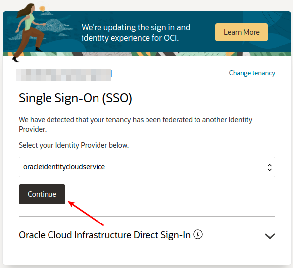
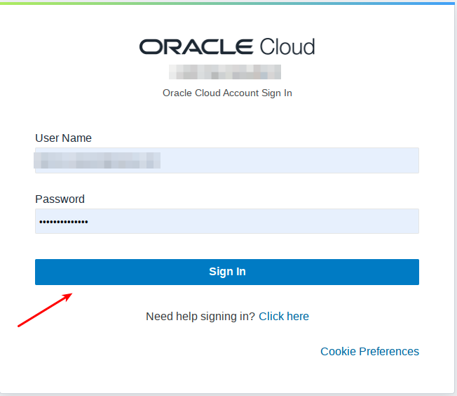
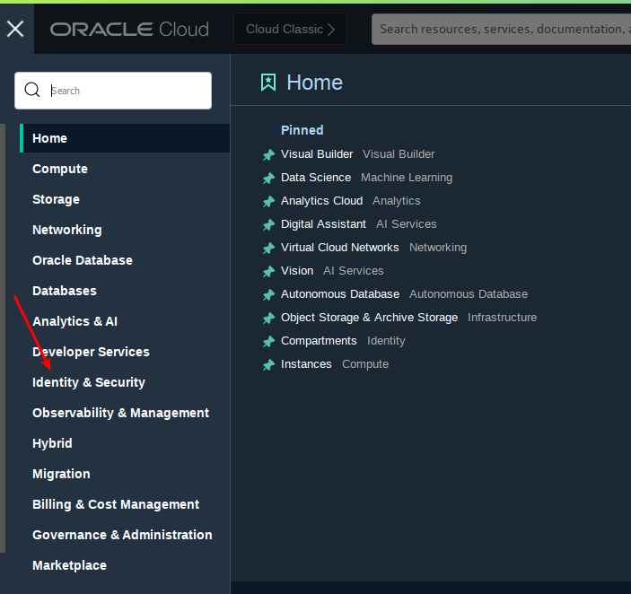

<!-- Updated June 15, 2022 -->
# Introduction to OCI

## Introduction

This lab will introduce you to Oracle Cloud Infrastructure (OCI), and take you through the console and cover a few of the foundational services that are frequently used with IaaS and PaaS services.  The console walkthrough is more of an awareness exercise rather than a detailed explanation of everything in OCI.  In addition to highlighting some key console features you will also create a Virtual Cloud Network and spin up a compute instance and install and access a web server on that instance.

**Estimated lab time: 120 minutes**

### Objectives

-   Learn how to access and navigate the OCI console.
-   Understand the basic essentials to working with OCI.
-   Create a VCN and compute instance, and install and access a web server.

### Prerequisites

-   Access to an OCI tenancy.  

## Task 1: Access The OCI Console

1. Log in to the Oracle Cloud.  At the time this workshop was being created OCI was updating it's support for federated identity management, and so the log-in screens will be different from these screen shots.  This [blog](https://blogs.oracle.com/cloudsecurity/post/oci-federation-with-oci-iam-identity-domains) and this [whitepaper](https://www.oracle.com/a/ocom/docs/security/what-oci-iam-customers-should-expect.pdf) explains the current (June 2022) and near future approach to federating OCI users and groups, which most developer customers will likely adopt.

    

    

2. Once you are logged in, you are taken to the cloud services dashboard where you can see all the services available to you. Click the navigation menu in the upper left to show top level navigation choices.  Note you can search for a service across all the menu items and also pin you favorites.  When you're done reviewing the menu items click the X to close the window.

    

       
     
3. Navigate to the Region drop down.  You will have a default region and can subscribe to others, depending on the initial regions assigned to you.  Note that Oracle has many regions around the world.  You can use these regions to co-locate applications and their user communities, and implement disaster recovery strategies.

    

[Oracle Regions as at June 2022](https://docs.oracle.com/en-us/iaas/Content/General/Concepts/regions.htm)

## Task 2: Learn Identity and Access Management Basics

1. As noted at the start of this lab, imminent changes to Identity Access Manager (OCI Console login - IAM) and Identity Cloud Service (IDCS) precludes covering users and groups, and navigating through related screens that have or will change.  Review the links provided above to understand more about identity management.  That said, policies will continue to be used to grant access to users and groups to OCI services.  In the Data Science lab you will need to create a policy to allow access to the Data Science service.

2.  Create a Compartment.  Compartments are the primary means to organize, segregate, and management access to OCI resources.  Every tenancy has a root compartment under which you create additional sub-compartments and sub-sub compartments (maximum six levels deep).  Compartments are tenancy-wide across regions. When you create a compartment, it is available in every region that your tenancy is subscribed to. You can get a cross-region view of your resources in a specific compartment with the tenancy explorer. See [Viewing All Resources in a Compartment](https://docs.oracle.com/en-us/iaas/Content/General/Concepts/compartmentexplorer.htm#Viewing_All_Resources_in_a_Compartment).  We will create a compartment for this course/workshop and create all related services in this compartment.  Navigate to the menu in the upper left and select Identity and Security, and then Compartments.

    

    

2.  

## Task 3: Learn Networking Basics

Although you can connect to your autonomous database from local PC desktop tools like Oracle SQL Developer, you can conveniently access the browser-based SQL Worksheet directly from your Autonomous Data Warehouse or Autonomous Transaction Processing console.

## Task 4: Learn Storage Basics

Run a query on a sample Oracle Autonomous Database data set.

## Task 5: Learn Compute Basics

## Task 6: Access Cloud Shell

## Troubleshoot Tips

    If you are having problems with any of the labs, please visit the Need Help? tab.

