<!-- Updated June 15, 2022 -->
# Introduction to OCI

## Introduction

This lab will introduce you to Oracle Cloud Infrastructure (OCI), and take you through the console and cover a few of the foundational services that are frequently used with IaaS and PaaS services.  The console walkthrough is more of an awareness exercise rather than a detailed explanation of everything in OCI.  In addition to highlighting some key console features you will also create a Virtual Cloud Network and spin up a compute instance and install and access a web server on that instance.

**Estimated lab time: 120 minutes**

### Objectives

-   Learn how to access and navigate the OCI console.
-   Understand the basic essentials to working with OCI.
-   Create a VCN and compute instance, and install and access a web server.

### Prerequisites

-   Access to an OCI tenancy.  

## Task 1: Access The OCI Console

1. Log in to the Oracle Cloud.  At the time this workshop was being created OCI was updating it's support for federated identity management, and so the log-in screens will be different from these screen shots.  This [blog](https://blogs.oracle.com/cloudsecurity/post/oci-federation-with-oci-iam-identity-domains) and this [whitepaper](https://www.oracle.com/a/ocom/docs/security/what-oci-iam-customers-should-expect.pdf) explains the current (June 2022) and near future approach to federating OCI users and groups, which most developer customers will likely adopt.

    

    

2. Once you are logged in, you are taken to the cloud services dashboard where you can see all the services available to you. Click the navigation menu in the upper left to show top level navigation choices.  Note you can search for a service across all the menu items and also pin you favorites.  When you're done reviewing the menu items click the X to close the window.

    

       
     
3. Navigate to the Region drop down.  You will have a default region and can subscribe to others, depending on the initial regions assigned to you.  Note that Oracle has many regions around the world.  You can use these regions to co-locate applications and their user communities, and implement disaster recovery strategies.

    

    [Oracle Regions as at June 2022](https://docs.oracle.com/en-us/iaas/Content/General/Concepts/regions.htm)


## Task 2: Learn Identity and Access Management Basics

1. As noted at the start of this lab, imminent changes to Identity Access Manager (OCI Console login - IAM) and Identity Cloud Service (IDCS) precludes covering users and groups, and navigating through related screens that have or will change.  Review the links provided above to understand more about identity management.  That said, policies will continue to be used to grant access to users and groups to OCI services.  In the Data Science lab you will need to create a policy to allow access to the Data Science service.

## Task 3: Create a Compartment

1. Compartments are the primary means to organize, segregate, and manage access to OCI resources.  Every tenancy has a root compartment under which you create additional sub-compartments and sub-sub compartments (maximum six levels deep).  Compartments are tenancy-wide across regions. When you create a compartment, it is available in every region that your tenancy is subscribed to. You can get a cross-region view of your resources in a specific compartment with the tenancy explorer. See [Viewing All Resources in a Compartment](https://docs.oracle.com/en-us/iaas/Content/General/Concepts/compartmentexplorer.htm#Viewing_All_Resources_in_a_Compartment).  We will create a compartment called **CareClinic** for this course/workshop and create all related services in this compartment.  Navigate to the menu in the upper left and select Identity and Security, and then Compartments.

    

    

    Create the new compartment.

    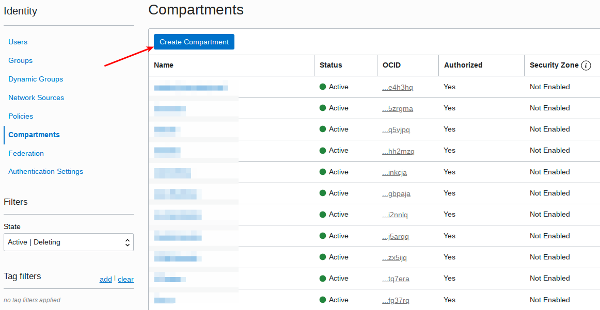

    

## Task 4: Use the Oracle Cloud Shell to Create SSH keys

1. Later in this lab you will be creating a compute instance.  Developers typically access compute instances using a SSH key.  A SSH key can be generated a few different ways (eg: puttygen on Windows or ssh-keygen on a mac or Linux), but the easiest way to do this in OCI is to use Cloud Shell.  The SSH (Secure Shell) protocol is a method for secure remote login from one computer to another. SSH enables secure system administration and file transfers over insecure networks using encryption to secure the connections between endpoints. SSH keys are an important part of securely accessing Oracle Cloud Infrastructure compute instances in the cloud.

    Oracle Cloud Shell is browser-based, does not require installation or configuration of software on your laptop, and works independently of your network setup.  The Cloud Shell machine is a small virtual machine with five GB of storage running a Bash shell which you access through the OCI Console (Homepage). Cloud Shell comes with a pre-authenticated OCI CLI (Command Line Interface), set to the Console tenancy home page region, as well as up-to-date tools and utilities. To use the Cloud Shell machine, your tenancy administrator must grant the required IAM (Identity and Access Management) policy.  More information about Cloud Shell can be found [here](https://docs.oracle.com/en-us/iaas/Content/API/Concepts/cloudshellintro.htm).

    **IMPORTANT: If the SSH key is not created correctly, you will not be able to connect to your environment and will get errors. Please ensure you create your key properly.**

2. To start the Oracle Cloud shell, go to your Cloud console and click the cloud shell icon at the top right of the page.  The shell will take several seconds to initialize and appear at the bottom of the console.

    

    

3. Once the cloud shell has started, enter the following commands. Choose the key name you can remember. This will be the keyname you will use to connect to any compute instances you create. Press Enter twice for no passphrase.

    ```
    <copy>
    mkdir .ssh
    cd .ssh
    ssh-keygen -b 2048 -t rsa -f cloudshellkey
    </copy>
    ```
    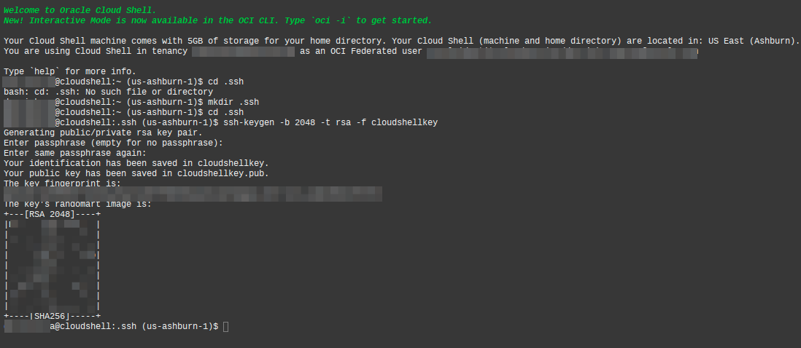

    We recommend using the name cloudshellkey for your keyname but feel free to use the name of choice.

4. List the two files that you just created.

    ```
    <copy>
    ls
    </copy>
    ```
    

    **Note: In the output, there are two files, a private key: cloudshellkey and a public key: cloudshellkey.pub. Keep the private key safe and don't share its content with anyone. The public key will be needed for various activities and can be uploaded to certain systems as well as copied and pasted to facilitate secure communications in the cloud.**

5. Download the public and private keys.  You will need to enter the public key when creating the compute instance later in this lab, and then need the private key to access that instance with a client tool or SSH.  Navigate to the hamburger menu in the upper left of the cloud shell and select Download.

    

    Download the following two files:

    ```
    <copy>
    .ssh/cloudshellkey
    .ssh/cloudshellkey.pub
    </copy>
    ```
    
    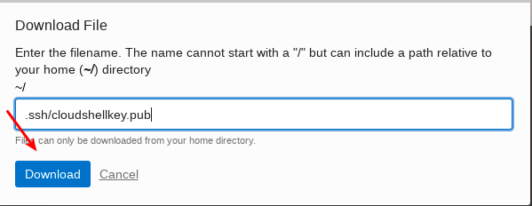

## Task 3: Create a Virtual Cloud Network (VCN)

1.  Introduction:  Networking, along with compute and storage is a critically important service in OCI, and is required by most if not all services.  It is a very big topic in cloud computing environments, and in this lab we will create a virtual cloud network that we'll use to access a compute instance later in this lab.  A Virtual Cloud Network (VCN) is a software-defined network that you set up in the Oracle Cloud Infrastructure data centers in a particular region. It enables your cloud resources to securely communicate through the internet with other instances running in OCI or your on-premises data centers. Be sure to review [Overview of Networking](https://docs.cloud.oracle.com/iaas/Content/Network/Concepts/overview.htm) to gain a full understanding of the network components and their relationships.  

    Network VCN Architecture:

    

    Navigate to networking.

    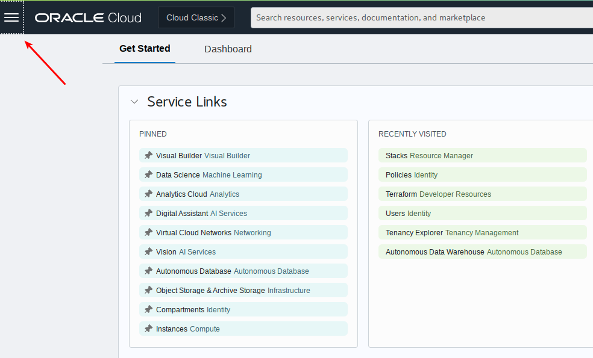

2.  Select Virtual Cloud Networks.  Note other network related services that you may wish learn about following this course.

    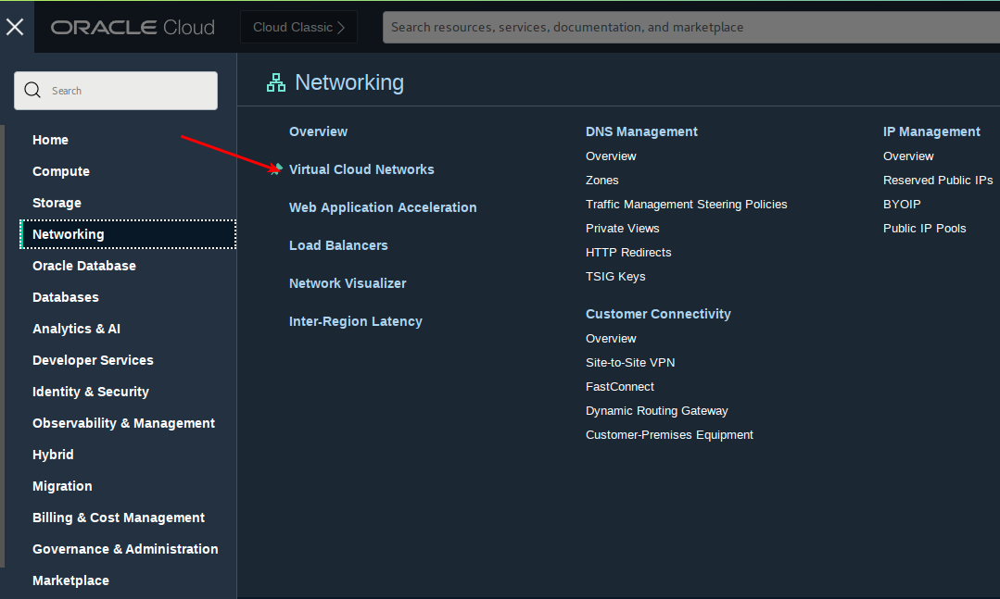

3. Create your VCN.  In this lab we will use the wizard to create our VCN.  However in the future developers would be advised to use the manual approach to creating VCNs as this will facilitate a greater understanding of the underlying components and give greater freedom to creating custom VCNs.  Select the **CareClinic** Compartment you created earlier on the left and then select **Start VCN Wizard**.

    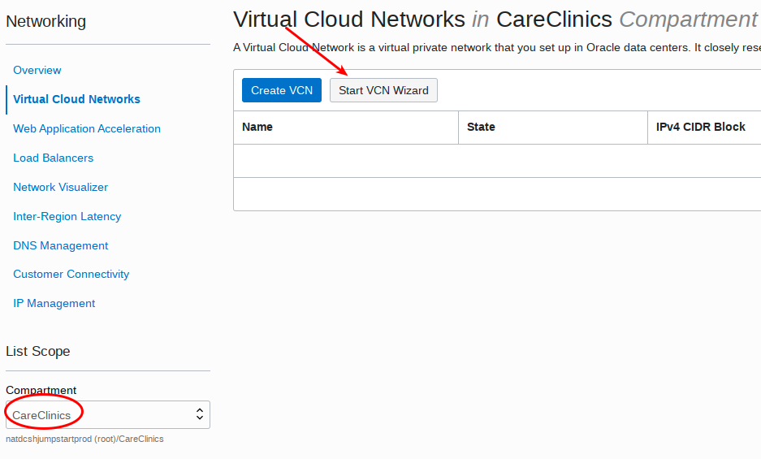

4. Take the default with Internet Connectivity and then select Start VCN Wizard.

    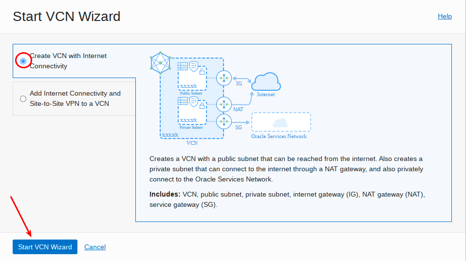

5. Name the VCN CareClinicVCN, ensure the Compartment is CareClinics, and ensure the CIDR blocks are as follows (these should be the defaults)

    

6. Select Create.  Note the create process will take several seconds.  This will create a VCN with public and private subnets, and Internet Gateway, a NAT Gateway, and a Service Gateway.

    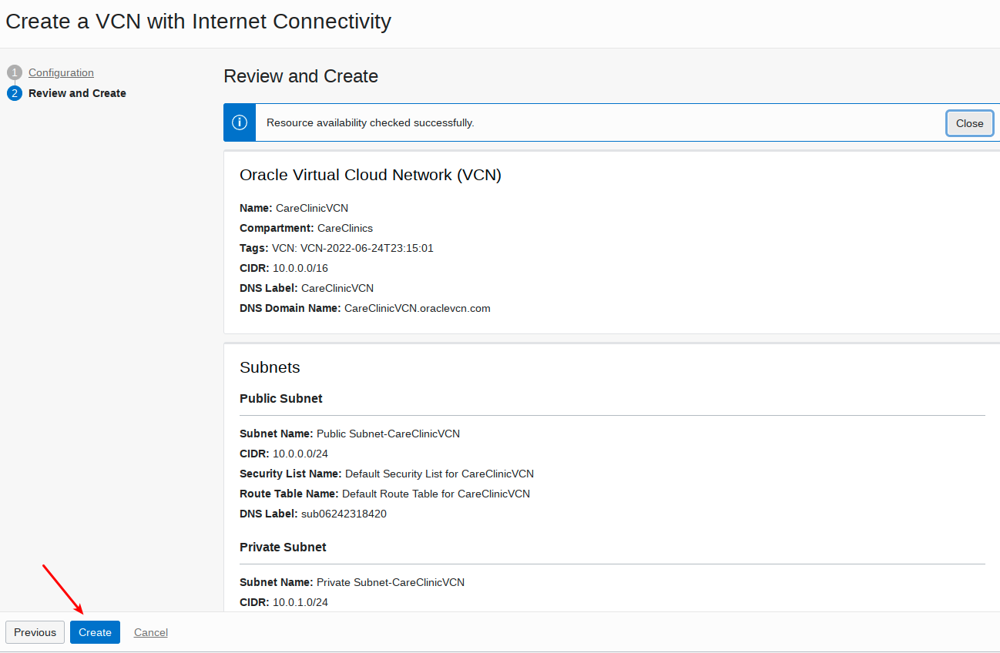

7. When it is complete select View Virtual Cloud Network to see the details.

    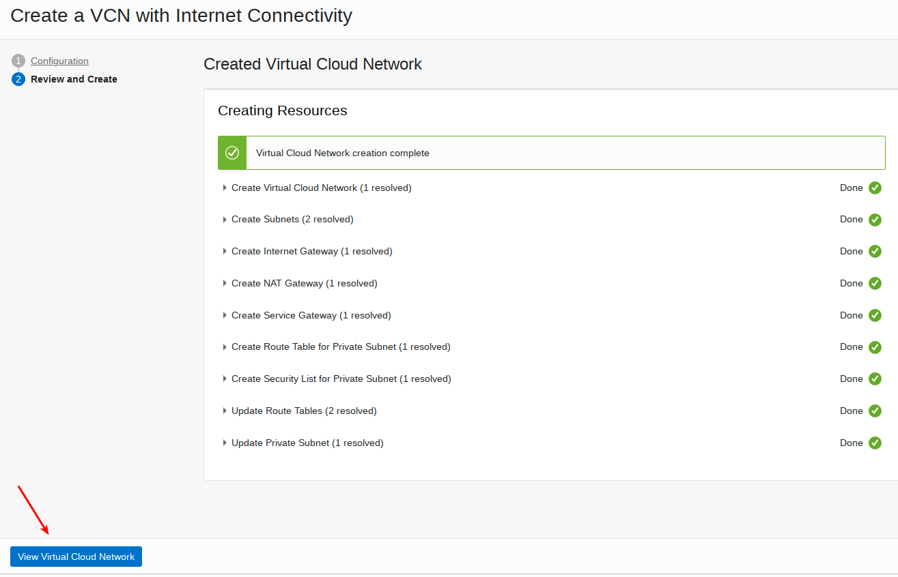

    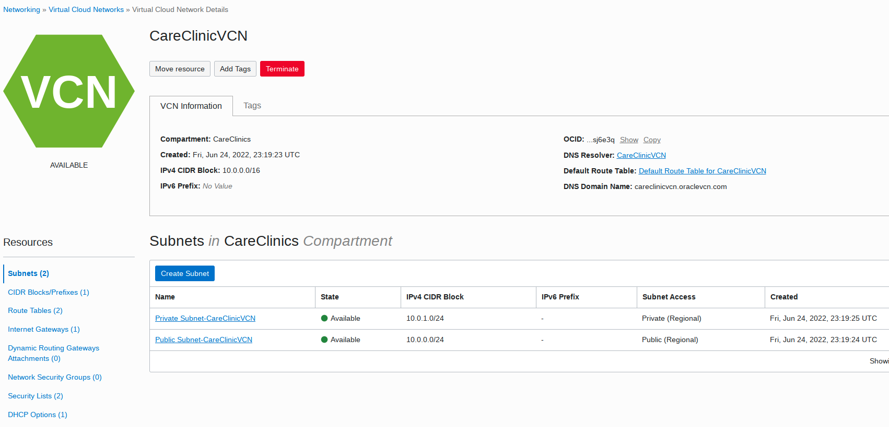

## Task 4: Review OCI Cloud Storage Options 

1. Introduction.  This task is an awareness exercise but should be covered as part of OCI's foundation services.  As with other foundational OCI services storage is big topic and you are encouraged to explore this topic beyond this course.  Here are the different types of storage and their durability, capacity, unit size, and use case.  Note the following storage types.

    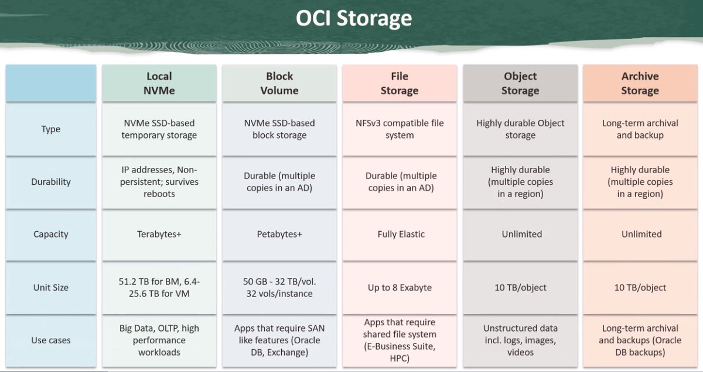

2. Navigate to Storage.

    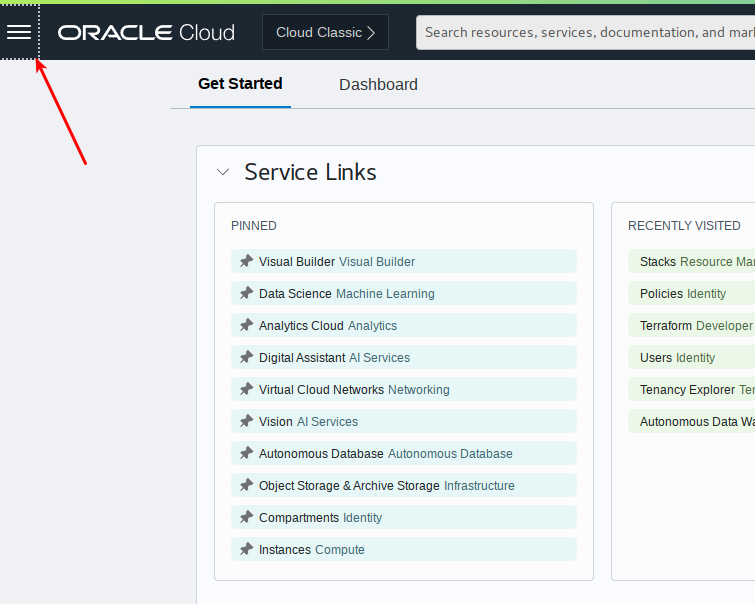

    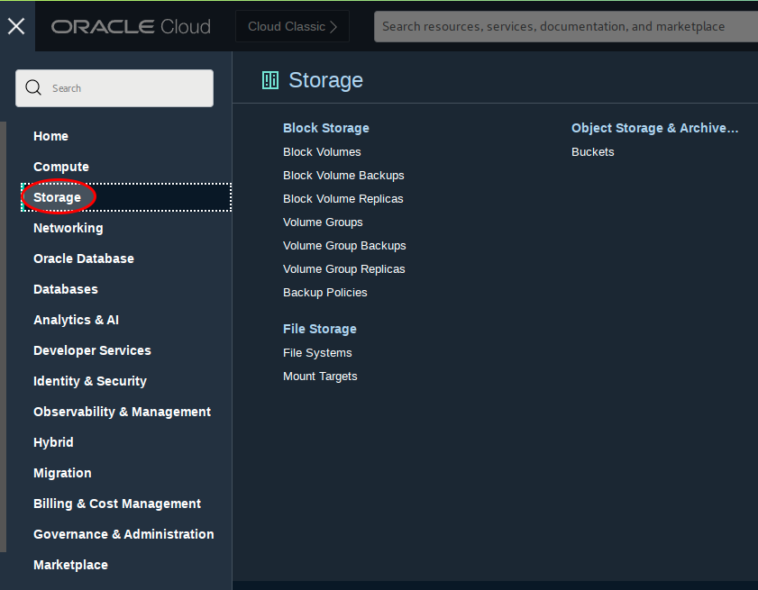

3. Create an Object Storage Bucket

    Since we will be working with Object Storage later in this workshop we'll create a new bucket called **CareClinic** in the CareClinic Compartment.  Navigate to Object Storage

    

    Ensure you are in the CareClinics Compartment and then select **Create Bucket**.

    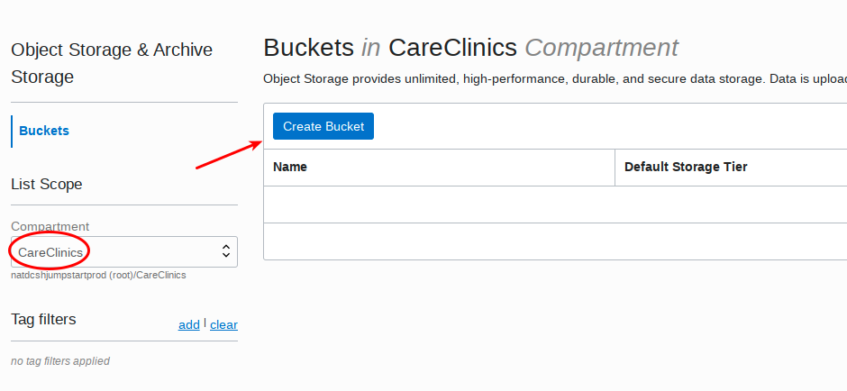

    Note the options when creating a bucket.  Archive Storage has a much lower cost but files in those buckets must be restored to standard storage prior to access.  Auto-Tiering enables automated movement from standard storage to archive storage when files are accessed infrequently.  Object Versioning is useful when updating files and you wish to keep version history.

    

    

    Object Storage is one of the more frequently used storage services, and supports the following:
    - Scripted uploads/downloads/updates to files using the OCI CLI.
    - Often used to automate processes such as using functions to detect file uploads to trigger other down stream processing.
    - Integrated with Automous Database for data loading and unloading, and can be used with external tables to query files in Object Storage with SQL in the database.
    - Used by Big Data as a storage service, and provides high speed read/write/query with predicate push down using Big Data SQL.
    - Used by Vision AI service for storage and processing of images.  Later in this workshop you will use Vision AI to do just that.

## Task 5: Create a Compute Service

    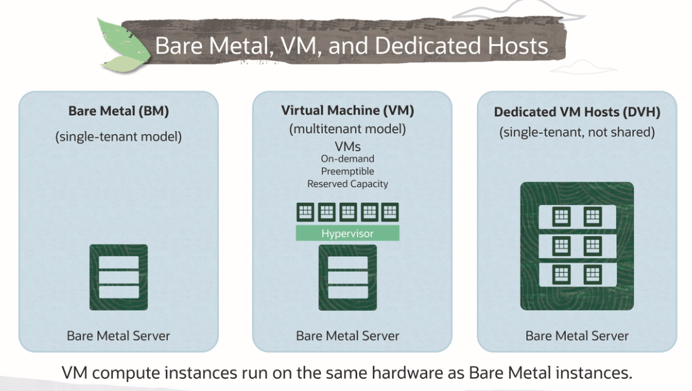


