<!-- Updated June 15, 2022 -->

# Introduction to Application Development

## Introduction

This lab walks you through the steps to quickly provision an Autonomous Transaction Processing instance and Oracle Kubernetes Cluster on Oracle Cloud. In this lab we will create Java/Helidon micro-service RESTful API to create a user in Autonomous Transaction Processing Database.

Estimated lab time: 2 hours

### Objectives

- Create a new Autonomous Transaction Processing Database
- Setup Database Configurations
- Create Oracle Kubernetes Cluster
- Containerize Java/Helidon RESTful microservice application and push it Oracle Cloud Infrastructure Registry
- Deploy RESTful microservice  into Oracle Kubernetes Cluster
- Test RESTful endpoints 

### Prerequisites

- This lab requires completion of the **Get Started** section in the Contents menu on the left.

## Task 1: Create Autonomous Transaction Processing Database
1.  Login to your Oracle Cloud Tenancy and open the side menu

    
    

2.  Navigate Autonomous Transaction Processing

    
    

3.  Select the correct compartment (Ex: Care Clinic) and click **Create an Autonomous Database**

    
    

4.  Give a prefered Display Name (Ex: CareClinicsDB) and click **Transaction Processing** for the workload type

    
    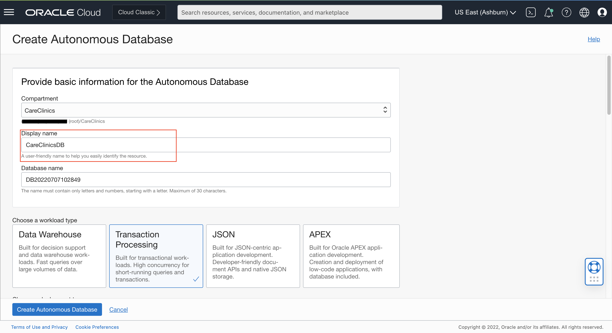

5.  Create the ADMIN password for the DB, following the database password requirements. Leave everything else as default

    *Note:* Make sure to save this password, you will need it later in this lab

    
    

6.  Click **Create Autonomous Database**

    
    

7.  Database provisioning will take about 5 minutes. Once the Lifecycle State is ***Available***, you can continue to the next task

    
    

## Task 2: Setup Database Configurations
1.  Click Database Actions

    
    

2. Click SQL Execute queries and scripts, and create database objects

    

3. At initial log-in, you are presented with guided tips, close the window for now.

    

4. Create the database user alpha by executing the following SQL Statements.
    ```
        <copy>create user alpha identified by "AppD3v0ps01_";
        grant dwrole to alpha;
        grant connect, resource to alpha;
        grant unlimited tablespace to alpha;
        </copy>
        ```

    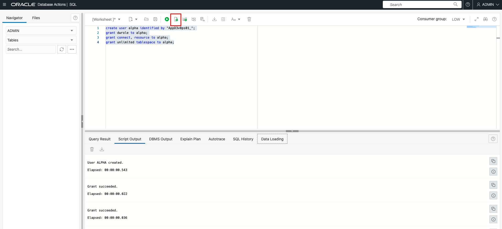

5. In SQL Developer Web connected as the user ADMIN, execute the following statements to grant user alpha to SQL Developer Web
    ```
        <copy>BEGIN
        ORDS_ADMIN.ENABLE_SCHEMA(
            p_enabled => TRUE,
            p_schema => 'ALPHA',
            p_url_mapping_type => 'BASE_PATH',
            p_url_mapping_pattern => 'alpha',
            p_auto_rest_auth => TRUE
        );
        COMMIT;
        END;
        /</copy>
        ```

    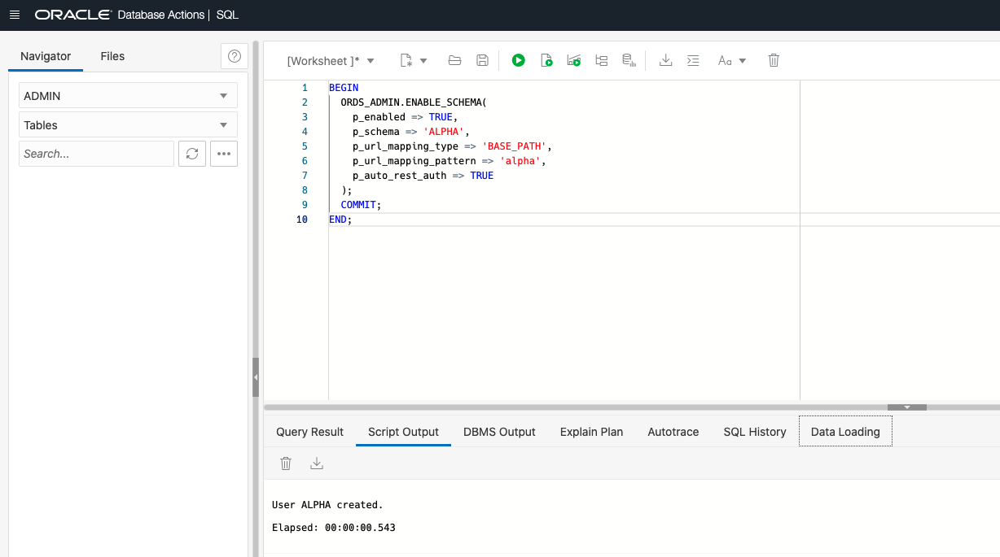

6. Sign Out from Admin.
     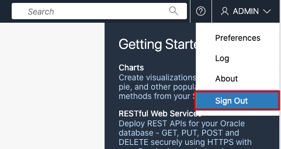

7. click Sign in.
     

8. Sign in back with Alpha as username and AppD3v0ps01_ as password.

     
     

9. Now you log Signed in as Alpha and Click SQL Execute queries and scripts, and create database objects.
    
     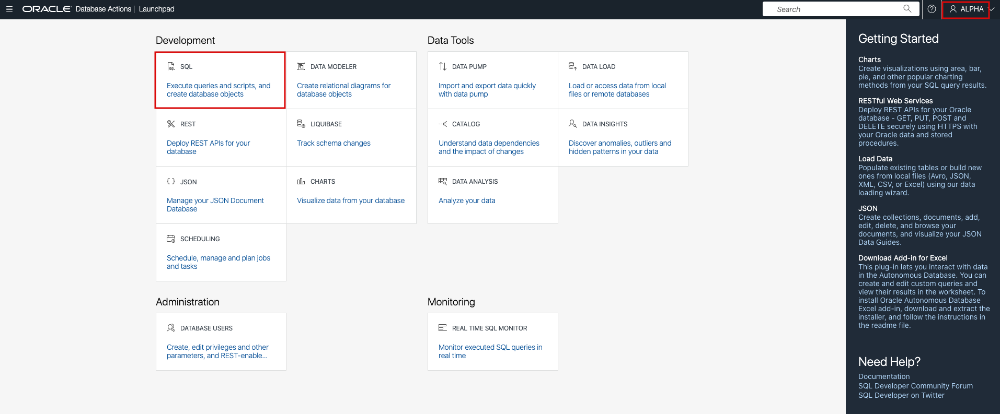

10. In the same SQL Developer Web Worksheet, execute the following SQL Statement to create the table users in the schema alpha.
    ```
        <copy>CREATE TABLE USERS(
        "ID" VARCHAR2(32 BYTE) DEFAULT ON NULL SYS_GUID(),
        "FIRST_NAME" VARCHAR2(50 BYTE) COLLATE "USING_NLS_COMP" NOT NULL ENABLE,
        "LAST_NAME" VARCHAR2(50 BYTE) COLLATE "USING_NLS_COMP" NOT NULL ENABLE,
        "USERNAME" VARCHAR2(50 BYTE) COLLATE "USING_NLS_COMP" NOT NULL ENABLE,
        "PASSWORD" VARCHAR2(50 BYTE) COLLATE "USING_NLS_COMP" NOT NULL ENABLE,
        "CREATED_ON" TIMESTAMP (6) DEFAULT ON NULL CURRENT_TIMESTAMP,
        CONSTRAINT "USER_PK" PRIMARY KEY ("ID"));

        CREATE TABLE REQUESTS(
        "ID" VARCHAR2(32 BYTE) DEFAULT ON NULL SYS_GUID() PRIMARY KEY,
        "CREATED_ON" TIMESTAMP (6) DEFAULT ON NULL CURRENT_TIMESTAMP,
        "REQUEST" BLOB
        CONSTRAINT ensure_json CHECK ("REQUEST" IS JSON));</copy>
        ```

    

11. To verify the table was created, Refresh the browser and select the ALPHA user. You will see the USERS table.

    
## Task 3: Create Oracle Kubernetes Cluster
1.  Login to your Oracle Cloud Tenancy and open the side menu

    
    


2. To create an OKE cluster, open up the hamburger button in the top-left corner of the Console and go to Developer Services > Container Clusters (OKE).


    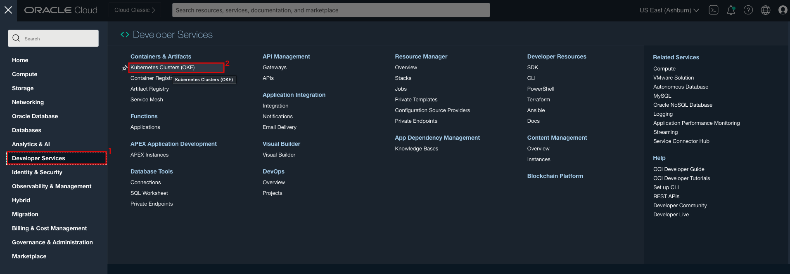

3. Verify you are in the Compartment and click Create Cluster.

    

4. Choose Quick Create as it will create the new cluster along with the new network resources such as Virtual Cloud Network (VCN), Internet Gateway (IG), NAT Gateway (NAT), Regional Subnet for worker nodes, and a Regional Subnet for load balancers. Select Launch Workflow

    

5. Keep values as default and click next to review the cluster settings.

    

6. Review the the Cluster Creation and then select **Create Cluster**.

    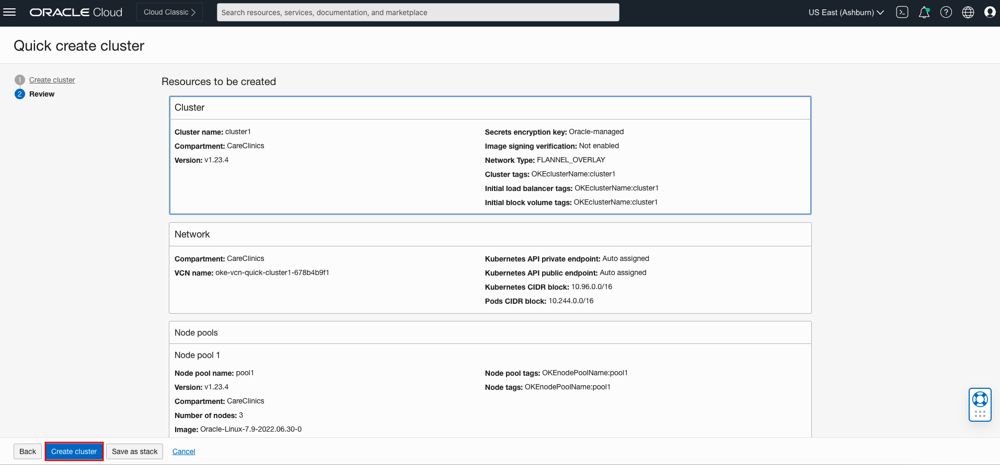
    

7. Once launched it should usually take around 5-10 minutes for the cluster to be fully provisioned and display an Active. 

    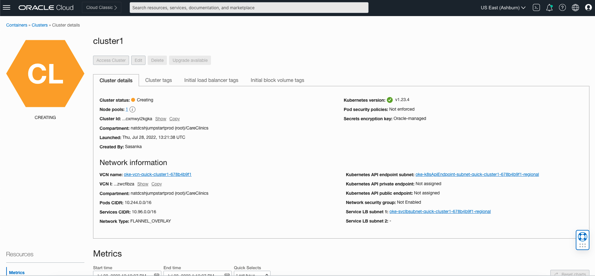
    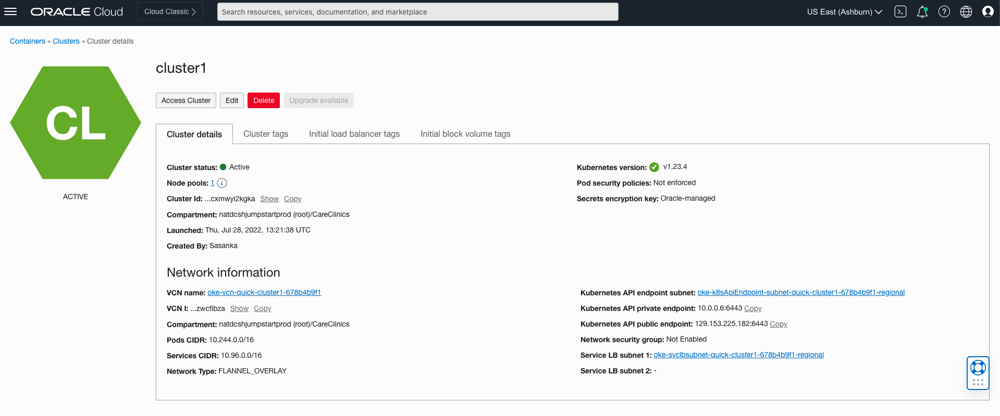

8. To start working with the Cluster, click Access Cluster.

    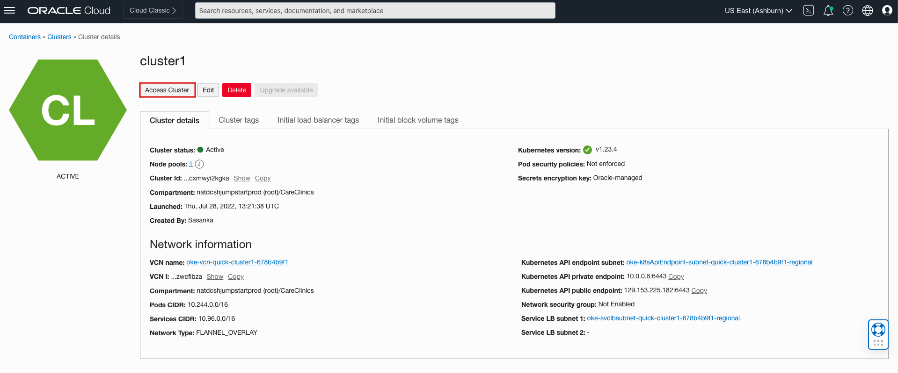

9. Click Cloud Shell Access
    
    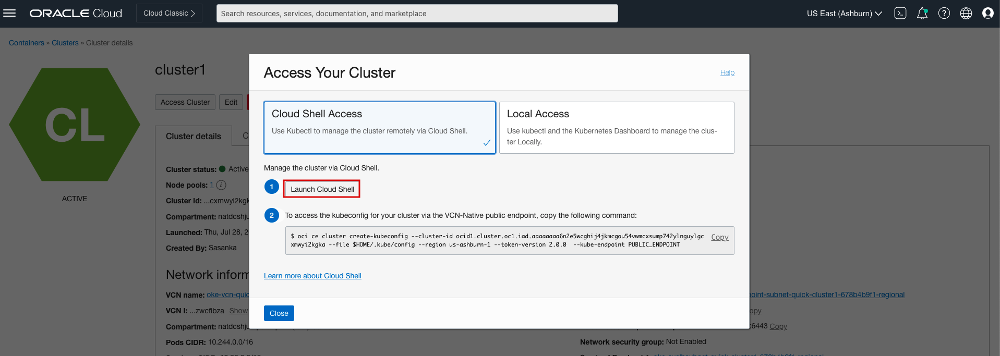
    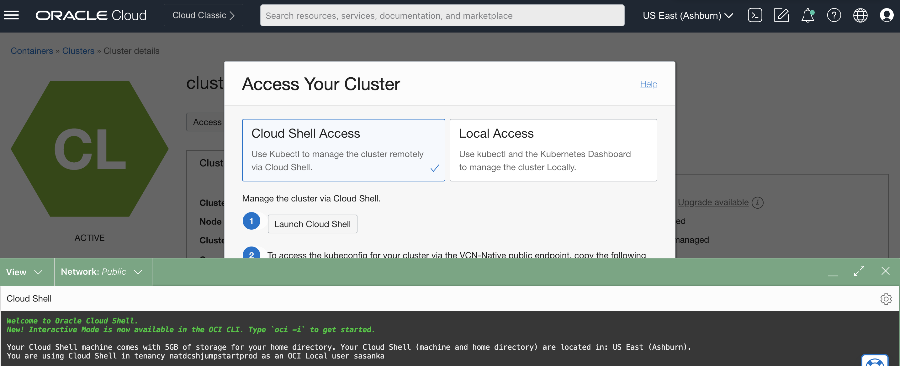

10. To access the kubeconfig for your cluster via the VCN-Native public endpoint, copy 2nd command

    

11. Copy and paste this command to verify your Kubernetes Cluster up and running.

    ```
        <copy> kubectl get nodes </copy>
        ```

    


## Task 4: Configure RESTful microservice  into Oracle Kubernetes Cluster
1.  Copy and paste following command to Cloud Shell Console.

    ```
        <copy> git clone https://github.com/sasankapdn/user-catalog.git </copy>
        ```

    ```
        <copy> cd user-catalog </copy>
        ```
    
    
    

2. Change app.yaml file using EDITOR and replace your docker image url as follows.

    
    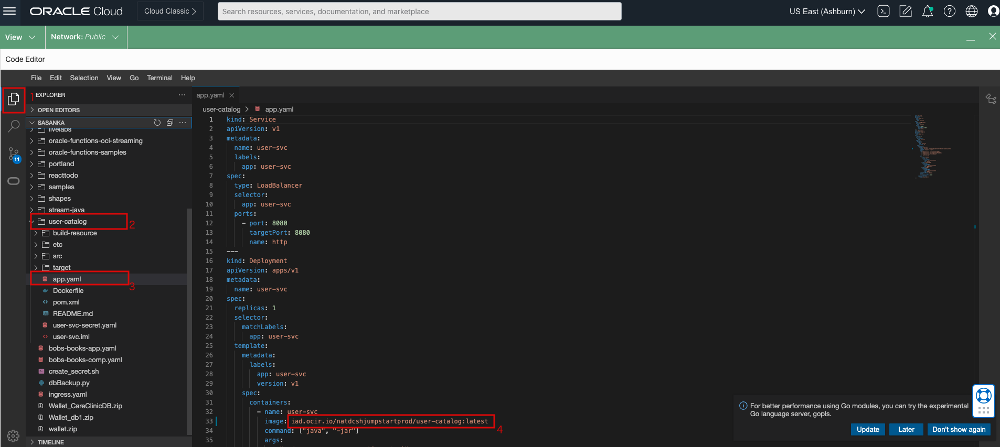

3. Change the DBusername, DBpassword and DBurl base64 coded in the user-svc-secret.yaml file. user-svc-secret.yaml files is applied to Kubernetes cluster, so that the ATP DB username, password and DBurl are configured with the application container. Go to OCI console, and click on cloud shell, once it is ready with your user directory, convert the values and save it in your notepad.

    ```
        <copy> echo -n Alpha | base64 </copy>
        ```

    ```
        <copy> echo -n AppD3v0ps01_ | base64 </copy>
        ```

    ```
        <copy> echo -n jdbc:oracle:thin:@CareClinicsDB_LOW?TNS_ADMIN=/helidon/wallet | base64 </copy>
        ```


    

4. select user-svc-secret.yaml file via EDITOR and edit the parameter values under data block for dbUser, dbPassword and dbUrl that you have encoded to base64.  

    

5. Click **Save All**

    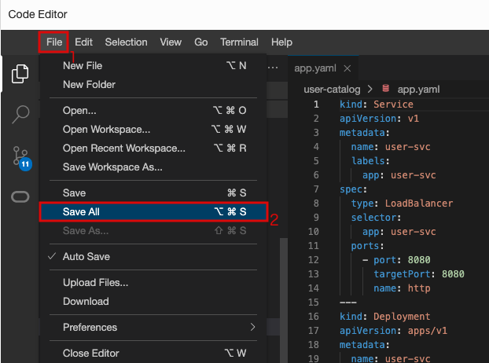

## Task 5: Download Database Wallet File 


1. Go back to Autonomous Database you created using search bar by typing **CareClinicsDB**.

   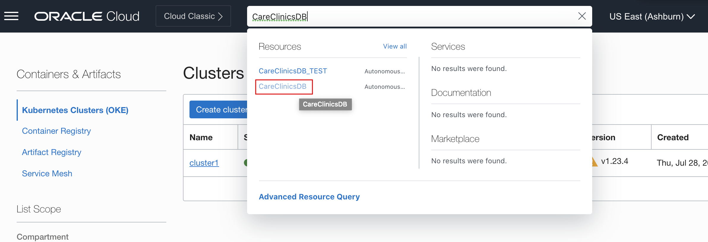

2. Click **DB Connection**
   
    

3. Click **Download Wallet** fiile.

    

4. Give required password for download wallet file.

    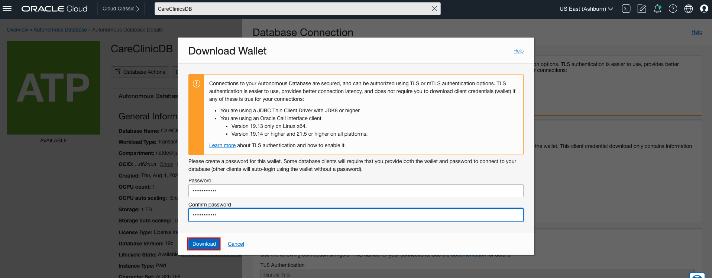

5. Drag and drop wallet zip file to **Cloud Shell** and wait to upload. 

    

6. This will upload into your home directory and you need to extract into application development wallet folder. Copy and paste following command.

    ```
        <copy> unzip Wallet_CareClinicDB.zip -d user-catalog/build-resource/wallet/ </copy>
        ```

    


## Task 6: Containerize Java/Helidon RESTful microservice application and push it Oracle Cloud Infrastructure Registry

1. Go to Oracle Cloud Main page and click user icon. 

    

2. Click ***Auth Tokens*** and Click ***Generate Tokens***. Give any description (ex: token) and click Generate Token.
    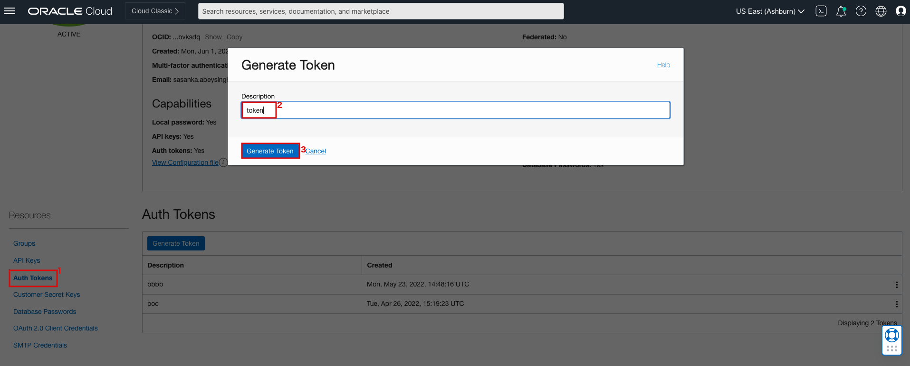


3. Copy and paste in a notepad.
   
    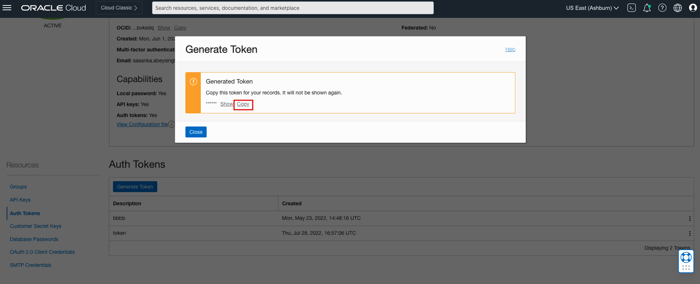
    

4. Login to Docker using above Auth Tokens as password and enter username as your cloud username. For username, press Enter.

    ```
        <copy> docker login iad.ocir.io </copy>
        ```

    

5. Copy and paste following command

    ```
        <copy> docker build -t user-catalog . </copy>
        ```

    

6. Copy and paste following command to view deployed docker image.

    ```
        <copy> docker images </copy>
        ```

    

7. Copy **IMAGE ID** from above step and replace your image id for following command.

    ```
        <copy> docker tag IMAGE_ID iad.ocir.io/TENANCY/user-catalog </copy>
        ```
    Note: Your tenancy object storage namespace can be copied from here.
    

8. Copy and paste following command to push it Oracle Cloud Infrastructure Registry

    ```
        <copy> docker push  iad.ocir.io/TENANCY/user-catalog </copy>
        ```

    


10. Copy and paste following command to deploy this micro-service into Kubernetes Cluster.

    ```
            <copy> kubectl create -f app.yaml </copy>
            ```

    

## Task 7: Test RESTful endpoints 
1.  Copy following command and paste it to Cloud Shell to view deployed REST web-services

    ```
            <copy> kubectl get svc </copy>
            ```

2. Replace IP address from endpoint and paste it URL to test your endpoint.

    ```
            <copy> curl -iX GET http://<ip_address>:8080/user </copy>
            ```

## Homework: Perform RESTful operations.

1. Perform List All users (curl -iX GET http://<ip_address>:8080/user/list)
2. Perform save new user (curl -iX POST -H "Content-Type: application/json" -d '{"firstName": "ABC", "lastName": "XYZ", "username": "alpha", , "password": "abc123" }' http://<ip_address>:8080/user/save                            
)
3. Delete new user (curl -iX DELETE  http://localhost:8080/user/<id>) Note: ID is returned in Location header in question 2.