<!-- Updated June 29, 2022 -->
# Introduction to Terraform and Oracle Resource Manager (ORM)

## Introduction

Oracle Cloud Infrastructure (OCI) Resource Manager is an Oracle-managed service that automates deployment and operations for all Oracle Cloud Infrastructure resources. Unlike Infrastructure-as-Code (IaC) offerings from other cloud vendors, the service is based on Terraform, a widely used, open source industry standard that allows DevOps engineers to develop and deploy their infrastructure anywhere. **Source:** [Oracle Resource Manager](https://www.oracle.com/devops/resource-manager/)

Please take a couple minutes to watch the following Introduction to Resource Manager.

[](https://youtu.be/ghOW03Dkrdg)

**Estimated lab time: 120 minutes**

### Objectives

-   Create a VCN using the Quick Start Template
-   Create a Compute Instance ORM Stack using the Instances Compute Console
-   Create an ORM Stack using the Template Feature
-   Create an ORM Stack using the Discover Feature
-   Download an ORM Stack, Review and Enhance it
-   Destroy all OCI Resources 

### Prerequisites

-   Access to an OCI tenancy.
-	Compartment **CareClinic**
-	SSH Public/Private Key Pair

## Task 1: Login in to the Oracle Cloud 

1. Log in to the Oracle Cloud from <https://www.oracle.com> , click on **View Accounts** then **Sign in to Cloud**

	

2. Enter the **Cloud Account Name** and click **Next**

	

3. Select **oracleidentitycloudservice** as the Identity Provider and click **Continue**

	

4. Enter your **username** (this may be your email address) and **password** and click on **Sign In**

	

5. You are now on the **Get Started** page of the Oracle Cloud Infrastructure (OCI) Console

	


## Task 2: Access Oracle Resource Manager

1.  From Oracle Cloud Infrastructure (OCI) Console click on the navigation menu in the upper left to display the OCI Service Groupings

	

2.  Select **Developer Services** then **Overview** under the **Resource Manager** group

	

3.  You are now presented with the **Resource Manager Overview** page

	

## Task 3: Create a VCN using the Quick Start Template

1.  From the **Resource Manager Overview** page, scroll down to the **Create** section and click on the **Provision a VCN that includes....** option

	

2.  Enter the name **VCN-Terraform** and select the Compartment **CareClinics** and click **Next**

	

3.  Accept the defaults on this page and click **Next**

	

4.  Accept the defaults and click **Create**

	

5.  The **VCN-Terraform** Resource Manager Stack is now created

	

6.  Click **Plan** then **Plan** again on the pop-out to execute a Plan against the Resource Manager Stack

	

7.  The Plan is now executed, once complete, it will change to green and have a **Succeeded** status

	

	

8.  You can scroll through the **Logs** for the Plan execution and see what resources will be added. You can also click on **Download Logs**. You will see that **6** resources will be created in OCI when this stack is applied. The resources created are

	-   Default Route Table
	-   Internet Gateway
	-   Default Subnets for AD1, AD2, AD3 (AD = Availability Domain)
	-   Default Security List
	-   Default DHCP Options
	-   Virtual Cloud Network (VCN)

	

9.  To execute this Stack and create the OCI Services listed in the Plan, scroll back up and click on **Stack Details** then click on **Apply** then **Apply** in the pop-out.

	

	

10. The Stack is now **IN PROGRESS**, once completed, the status will change to **SUCCEEDED** .

	

	

11. Let's examine the **Logs** to see what was created. You can see from the **Logs** the 6 OCI resources were created.

	

12. You can also click on **Outputs** the resources listed along with their corresponding OCIDs are listed.

	

13. To see the VCN resources created within the OCI Console, click on the navigation menu in the upper left, select **Networking**, **Virtual Cloud Networks**

	

14. You are presented with the VCN Page where you will see the **testVCN** created by the Oracle Resource Manager (ORM) Stack. Be sure your compartment is **CareClinics.** Click on the **testVCN** name to see the details.

	

15.  Here you will see can see all the information related to the VCN **testVCN**. You can also see and access all the resources that make up this VCN. Feel free to click around and explore.

	


## Task 4: Create a Compute Instance ORM Stack using the Instances Compute Console

1. Navigate to the **Compute** Services group and select **Instances**

	

2. Be sure the **CareClinics** Compartment is selected and click **Create instance**

	

3. Enter the name **testCompute**, accept the defaults under the sections **Image and Shape** and **Networking**

	

4. In the **Add SSH keys** section, drop the public SSH Key **cloudshellkey.pub** you created earlier in **Task 4: Use the Oracle Cloud Shell to Create SSH keys** of the **Introduction to OCI** Lab

	

5. Accept the defaults under section **Boot Volume** and click **Save as Stack**

	

6. You are now redirected to ORM **Create Stack** page. Enter the name **Compute-Terraform**, be sure the **CareClinics** compartment is still selected and click **Next**

	

7. There are no Terraform Variables defined, so click **Next**

	

8. This time we will create AND apply the ORM Stack at the same time. To do this, enable the **Run Apply** option and click **Create**.

	

9. The Resource Manager Apply job is now executing, the status will go from **ACCEPTED** to **IN PROGRESS** to **SUCCEEEDED**.

	

10. Examining the **Logs**, you will see **1** resource was added

	

11. Examining the **Job Resources**, you can see the **Attribute** details for **testCompute** by clicking **Show**. Here you will see the **Public** and **Private IP Addresses** assigned to the compute instance.

	

12. If you click on the Resource Name **testCompute**, this will open the **Instance details** page. Here you can see the all the details related to this compute instance.

	

13. Using the desired command prompt, we can test the SSH connection to the newly compute instance by issuing the below command. You will use the private key **cloudshellkey** you created earlier along with **Public IP address** and the user **opc**

    ```
    <copy>
	ssh -i cloudshellkey opc@{compute_public_ip_address}
	</copy>
    ```

	


## Task 5: Create an ORM Stack using the Template Feature

1. Navigate to Resource Manager's Stacks page and click **Create Stack**. Be sure you are in the **CareClinics** Compartment.

	

2. On the **Create Stack** page, select **Template**, be sure the **CareClinics** compartment is selected, click on **Select Template** to select the desired OCI resource to create.

	

3. On the **Browse templates** pop-out, select the **Service** tab, **Compute Instance**, click the expand icon to read what will be deployed. Lastly, click the **Select Template** button to proceed.

	**Note:** You can also select **Quickstarts** and **Architecture** templates for deploying out-of-the-box OCI environments.

	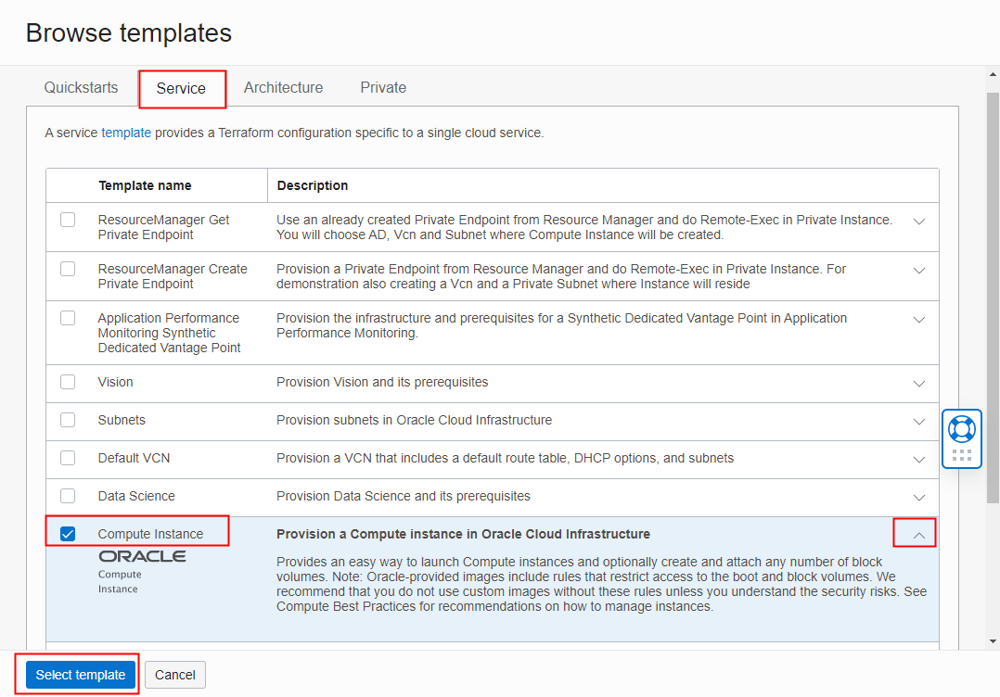

4. Scroll down and enter the Stack name **Compute Instance-Template.** Be sure you are in the **CareClinics** Compartment and click **Next**.

	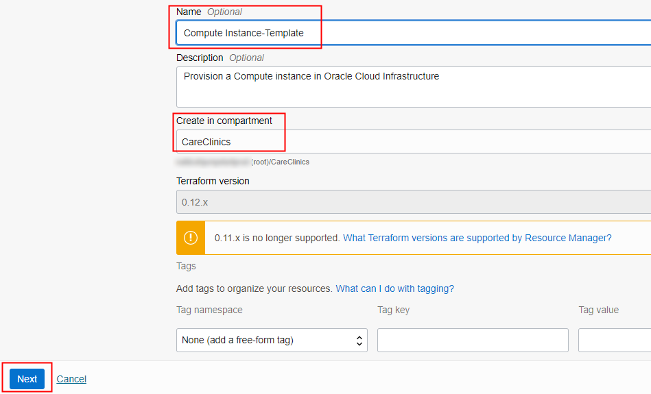

5. Enter the compute instance name **ComputeTemplate**, select the **CareClinicVCN** VCN, select the subnet **Public Subnet-CareClinicVCN (Regional)** under the **Required Configuration** section

	

6. Scroll down and enable **Assign Public IP** and choose the SSH Key file **cloudshellkey.pub** under the **Optional Configuration** section and click **Next**.

	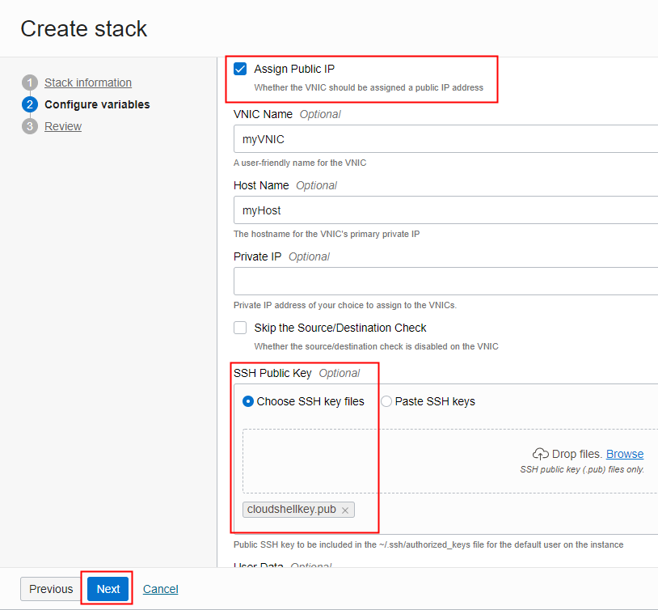

7. Click **Create** on the Review screen

	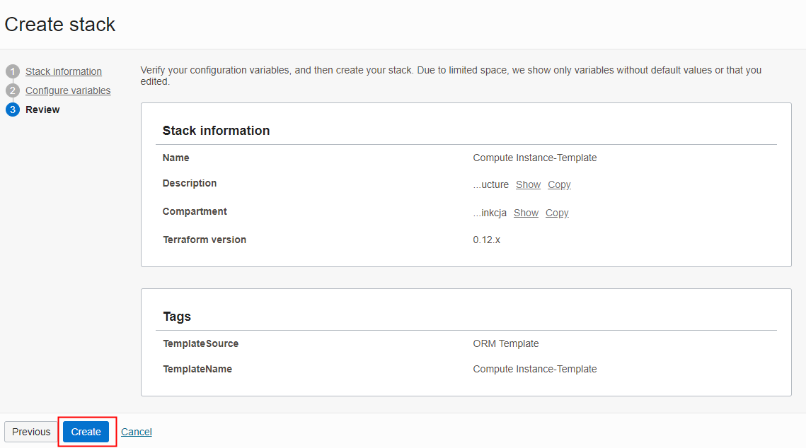

8. The ORM Stack is now created. Let's run a **Plan** and see what would be created if we were to Apply it. Click on the **Plan** button on top of the page, then click **Plan** on the pop-out.

	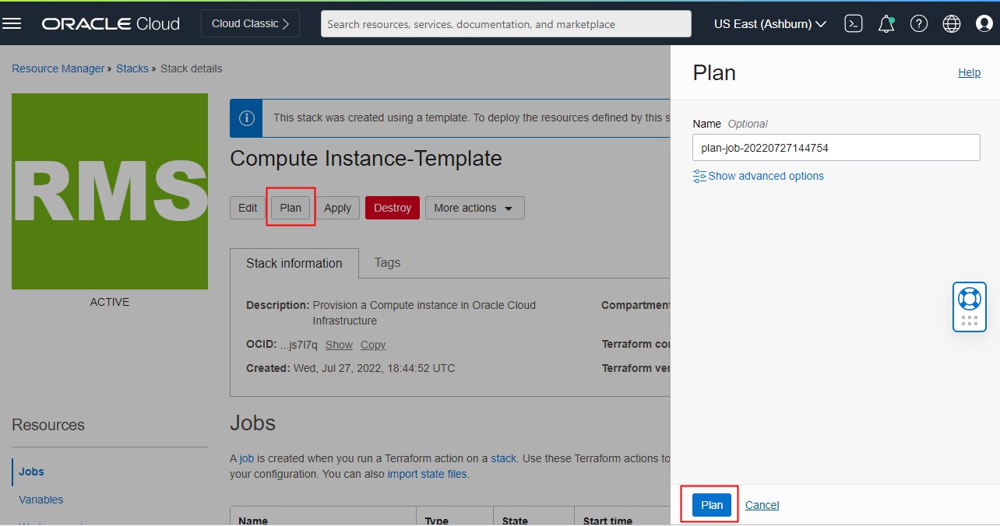

9. The status of the plan job will change from **IN PROGRESS** to **SUCCEEDED**. Click on **Logs** and scroll to the bottom. You will notice, 3 items will be created, and **OCI Compute Instance**, **OCI Boot Volume** and **OCI Boot Volume Attachment**.

	

10. At this point, if you were to **Apply** this ORM stack, it would fail since the **VM.Standard.E2.1.Micro** Compute Shapes are only available in **Availability Domain 3 (AD3)** and this ORM Stack was written to leverage **AD1**. In **Task 7**, we will download the **Terraform Configuration** and edit it accordingly to allow the Availability Domain to be selected.

	```
	Error: Service error:NotAuthorizedOrNotFound. shape VM.Standard.E2.1.Micro not found. http status code: 404.
	```

	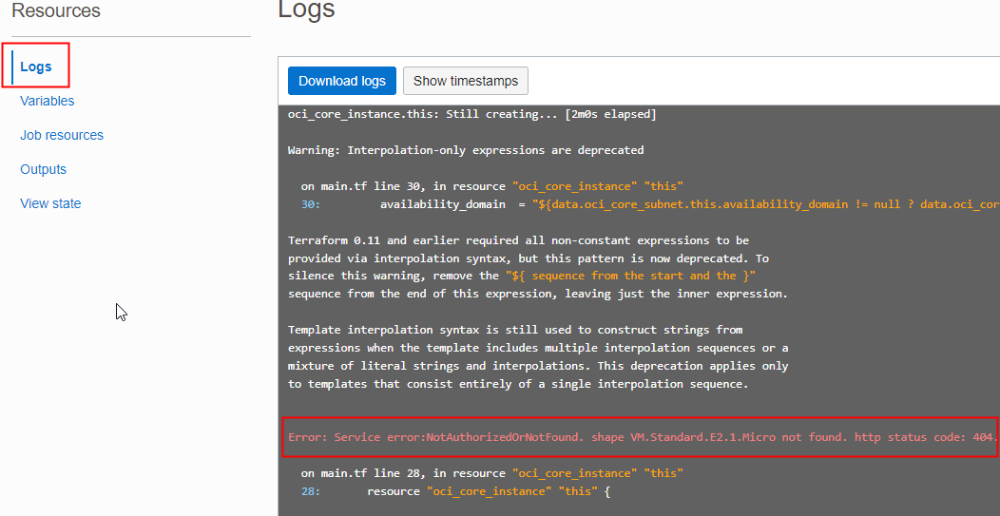


## Task 6: Create an ORM Stack using the Discover Feature

1. Navigate to Resource Manager's Stacks page and click **Create Stack**. Be sure you are in the **CareClinics** Compartment.

	

2. On the **Create Stack** page, select **Existing Compartment**, be sure the **CareClinics** compartment is selected, select **Selected** for the services we want to discover and then **database** for the filter. Lastly, update the name by adding the prefix **databases-** and click **Next**

	

3. Click **Next** on the Configure Variables page

	

4. Click **Create** on the Review Page

	

5. The status of the stack will go from **CREATING** to **ACTIVE**

	

	

6. Scroll down and select **Stack Resources** to see the databases discoverer. You can **Show** the Terraform Attributes to the details for the **CareClinicsDB**.

	

## Task 7: Download an ORM Stack, Review and Enhance it

We are now going to revisit the ORM Stack we created in **Task 5**.  In this task, we will download the Terraform Configuration files, review and edit the files to allow the user the ability to select the desired Availability Domain.  Documentation can be referenced in section [Task 1b: Create Your Own Terraform Configuration](https://docs.oracle.com/en-us/iaas/Content/ResourceManager/Concepts/samplecomputeinstance.htm)

1. Navigate to Resource Manager's **Stacks** page and click on the stack **Compute Instance-Template**. Be sure you are in the **CareClinics** Compartment.

	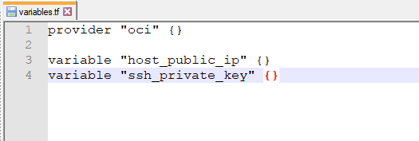

2. Click **Download** to download the Terraform Configuration (Scripts) to your local machine.

	

3. Once downloaded, locate the ZIP file, and extract it to your local file system. The ORM Stack file name should look similar to this one below. It will contain the following files.

	

	* **main.tf** - Contains the Provider along with all OCI Resources that will be provisioned.
	* **outputs.tf** - Allows you to define what outputs are displayed in the Oracle Cloud Infrastructure Console. 
	* **schema.yaml** - Schema documents are recommended for Terraform configurations when using Resource Manager. Including a schema document allows you to extend pages in the Oracle Cloud Infrastructure Console. Facilitate variable entry in the Create Stack page by surfacing SSH key controls and by naming, grouping, dynamically prepopulating values, and more.
	* **variables.tf** - Define the variables you want to use when provisioning your resources. A best practice is to create a "variables" file in the configuration package that you upload.

4. Edit **variables.tf** using your desired text editor and add the follow line.

	```
    <copy>
	variable "availability_domain_name" {}
	</copy>
    ```

	

5. Edit **schema.yaml** using your desired text editor under the **requiredConfig** section and add the following line

	```
    <copy>
	- availability_domain_name
	</copy>
    ```

	

6. Edit **schema.yaml** using your desired text editor under the **variables** section and add the following lines

	```
    <copy>
	availability_domain_name:
	  type: oci:identity:availabilitydomain:name
	  dependsOn:
	    compartmentId: compartment_ocid
	  required: true
	  title: ${Messages.solutionsHub.genericVariables.availability_domain_name.title()}
	  description: ${Messages.solutionsHub.genericVariables.availability_domain_name.description()}
	</copy>
    ```

	

7. Edit **main.tf** using your desired text editor under the **variables** section and add the following line **AND** comment out the existing **availability_domain** line.

	```
    <copy>
	availability_domain = var.availability_domain_name
	</copy>
	```
	
	

8. Create a new ZIP file with the name **Compute-Instance-Template-New.zip**. Make sure it contains the following files. Some of which you just updated.

	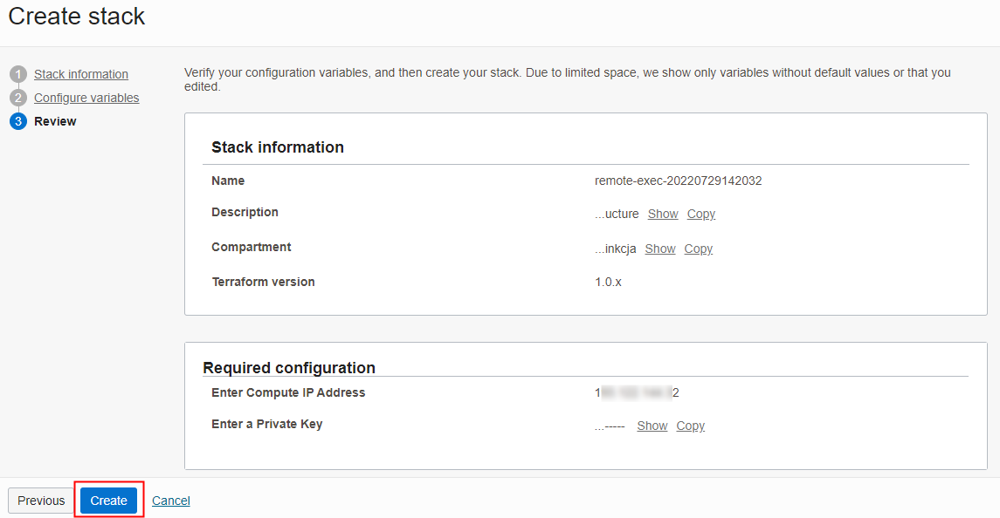

9. Create a new ORM Stack from the file **Compute-Instance-Template-New.zip**. Click on the **Create Stack**. Be sure you are in the **CareClinics** Compartment.

	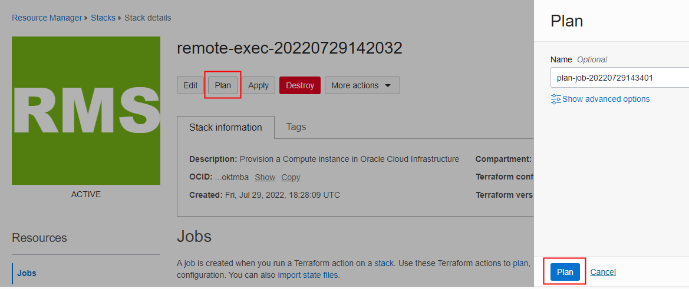

10. Select **My configuration**, select **.Zip file** and drag/drop the file **Compute-Instance-Template-New.zip.** Also, scroll down and enter the Stack Name of **Compute-Instance-Template-New** and verify the Compartment is **CareClinics** and click **Next**

	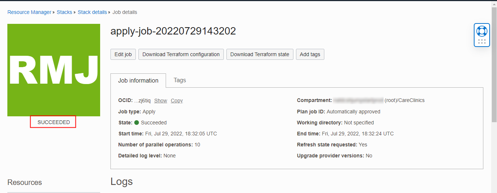

	

11. Enter the name **Compute-Template**, select the **-AD-3** Availability Domain, select the **CareClinicVCN** and select the Subnet **Public Subnet-CareClinicVCN (Regional)**.

	**Note:** The **[Always-Free](https://docs.oracle.com/en-us/iaas/Content/FreeTier/freetier_topic-Always_Free_Resources.htm)** shape **VM.Standard.E2.1.Micro** is only available in the **AD-3** Availability Domain.

	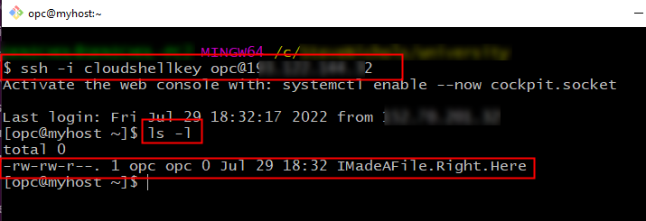

12. Select **Assign Public IP**, drag/drop the SSH Public Key **cloudshellkey.pub** and click **Next**

	

13. Click **Create**

	

14. Click **Plan**, then **Plan**

	

15. After a **SUCCEEDED** Plan, Click **Stack Details**

	

16. Click **Apply**, then **Apply**

	

17. Once the **Apply** Job has **SUCCEEDED**, click on **Outputs**, here you can see the **public** and **private** **IP Address** of the Compute Instance that was just provisioned.

	

18. You can also click on **Job resources** and see the 3 Cloud Services provisioned by this ORM Stack. Click on **Compute-Template**.

	

19. You are now in the **Compute->Instances->Instance details** page. Here you can also see details such as **Public IP Address, VCN, Availability Domain**, etc.

	

## Task 8: Advanced Feature remote-exec

With Resource Manager, you can use Terraform's remote exec functionality to execute scripts or commands on a remote computer. You can also use this technique for other provisioners that require access to the remote resource.  More information can be found at [Using Remote Exec Documentation](https://docs.oracle.com/en-us/iaas/Content/ResourceManager/Tasks/usingremoteexec.htm).

1. Using a text editor, lets create the following Terraform Configuration files

	- **remote-exec.tf**	- This will contain the Terraform resource remote-exec
	- **variables.tf**		- This will contain the required variables
	- **schema.yaml** 		- This file facilitates variable entry when creating and editing ORM Stacks

2. Create the **variables.tf** file

	```
    <copy>
	provider "oci" {}
	variable "host_public_ip" {}
	variable "ssh_private_key" {}
	</copy>
	```

	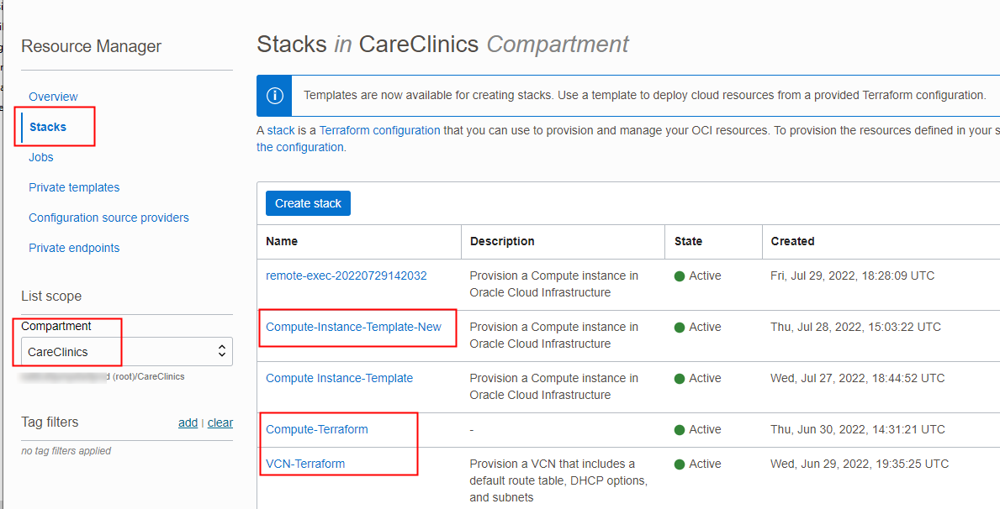

3. Create the **remote-exec.tf** file

	**Note:**  Here you will notice the **inline** command **touch** is executed after connecting to the Compute Instance's **public IP address** as user **OPC** with a **private SSH key**.

	```
    <copy>
	resource "null_resource" "remote-exec" {
	  provisioner "remote-exec" {
		connection {
		  agent       = false
		  timeout     = "30m"
		  host        = "${var.host_public_ip}"
		  user        = "opc"
		  private_key = "${var.ssh_private_key}"
		}
	  
		inline = [
		  "touch ~/IMadeAFile.Right.Here"
		]
	  } 
	}
	</copy>
    ```

	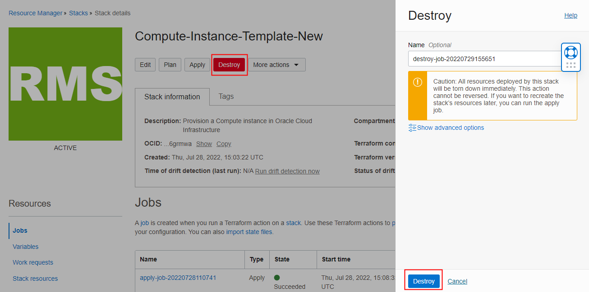

4. Create the **schema.yaml** file

	```
    <copy>
	  title: "Update a Compute instance using remote-exec"
	  stackDescription: ${Messages.solutionsHub.solutions.computeInstance.stackDescription()}
	  schemaVersion: 1.1.0
	  version: "20200301"
	  locale: "en"

	  variableGroups:  
	  - title: ${Messages.solutionsHub.requiredConfig()}
		visible: true  
		variables:
		- host_public_ip
		- ssh_private_key

	  variables:
		host_public_ip:
		  type: string
		  required: true
		  title: "Enter Compute IP Address"
		  description: "Enter the Public IP Address of the Compute Instance from Task 7"
		ssh_private_key:
		  type: text
		  multiline: true
		  required: true
		  title: "Enter a Private Key"
		  description: "Enter the value from the cloudshellkey file"
	</copy>
    ```

	

5. Zip the three files you just created into a file called **remote-exec.zip**.

	

6. Navigate to Resource Manager's Stacks page and click **Create Stack**. Be sure you are in the **CareClinics** Compartment.

	

7. On the **Create Stack** page, select **My Configuration**, select **.Zip file,** drag/drop the file **remote-exec.zip**, accept all the other default values and click **Next.**

	

8. Enter the Compute Instance **Public IP Address** from Task 7. Also enter the SSH Private Key from the file **cloudshellkey** and click **Next**

	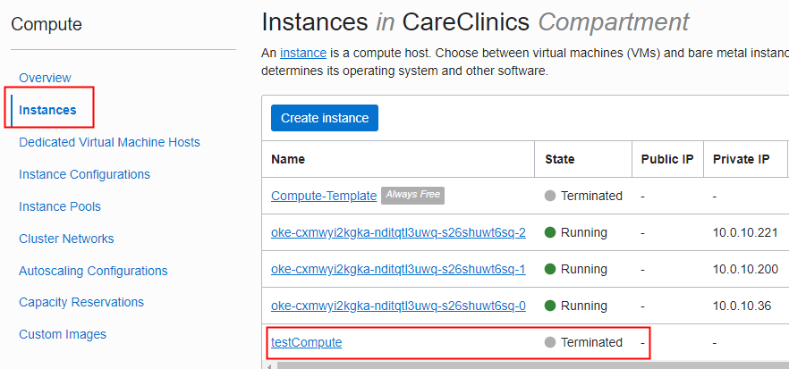

9. Click **Create**

	

10. Click **Plan** and **Plan**

	

11. The status of the Plan will become **SUCCEEDED**

	

12. You will see in the **Logs**, Terraform connected to the Compute Instance and completed the **Inline** command.

	

13. If you SSH into the compute Instance using a local command shell, you will see the file **IMadeAFile.Right.Here** was created successfully.

	

## Task 9: Destroy all OCI Resources

1. We will now leverage the **Destroy** functionality in Terraform to delete the OCI Services provisioned earlier.

	**Note:** Executing a **Destroy** does NOT delete the ORM Stack (Terraform Configuration Files), but rather will delete the OCI Services provisioned during the **Plan** job. The ORM Stacks can be leveraged again to provision the same OCI services at a future time.

2. Navigate to Resource Manager's Stacks page. Be sure you are in the **CareClinics** Compartment. We created OCI Services in 3 ORM Stacks which are highlighted in Red below. Click on the Stack **Compute-Instance-Template-New**.

	

3. Click on **Destroy**, then **Destroy** in the pop-out.

	

4. If you navigate over to the Compute Instances Page quickly, you will see the instance is in a State of **Terminating**.

	

5. Once the **Destroy** Job is **SUCCEEDED**, if you examine the **Logs**, you will see the 3 services originally created by this Stack are now deleted.

	

	

6. Let's repeat this process for Stack **Compute-Terraform**. Click on **Destroy**, then **Destroy** in the pop-out.

	

7. Once the **Destroy** job is **SUCCEEDED**, you will see the Compute Instance has a state of **Terminated**.

	

8. Let's repeat this process for Stack **VCN-Terraform**. Click on **Destroy**, then **Destroy** in the pop-out.

	

9. Once **SUCCEEDED**, you can examine the **Logs** and see the 6 resources created by the stack have been destroyed.

	

## Homework: Create an OCI Service Using ORM - Terraform

1. The plan is to remove **Task 6: Create an ORM Stack using the Discover Feature** from above and it will be the homework.

## Additional Resources

[Oracle Resource Manager Product Page](https://www.oracle.com/devops/resource-manager/)

[Oracle Resource Manager Documentation](https://docs.oracle.com/en-us/iaas/Content/ResourceManager/home.htm)

[Terraform Documentation for Oracle Cloud Infrastructure (OCI)](https://registry.terraform.io/providers/oracle/oci/latest/docs)
