<!-- Updated June 15, 2022 -->

# Build APEX Application on ATP

## Introduction

This lab walks you through the steps to quickly provision an Autonomous Transaction Processing instance on Oracle Cloud. In this lab we will create web application which will take medical documents and store them in the Autonomous Database. Further we will also use Oracle Text to allow users to filter, search, and view those documents with one-click.

Estimated lab time: 2 hours

### Objectives

- Create a new APEX workspace 
- Build a web application
- Explore Oracle Text 

### Prerequisites

- This lab requires completion of the **Get Started** section in the Contents menu on the left.

## Task 1: Create Autonomous Transaction Processing Database
1.  Login to your Oracle Cloud Tenancy and open the side menu


2.  Navigate Autonomous Transaction Processing

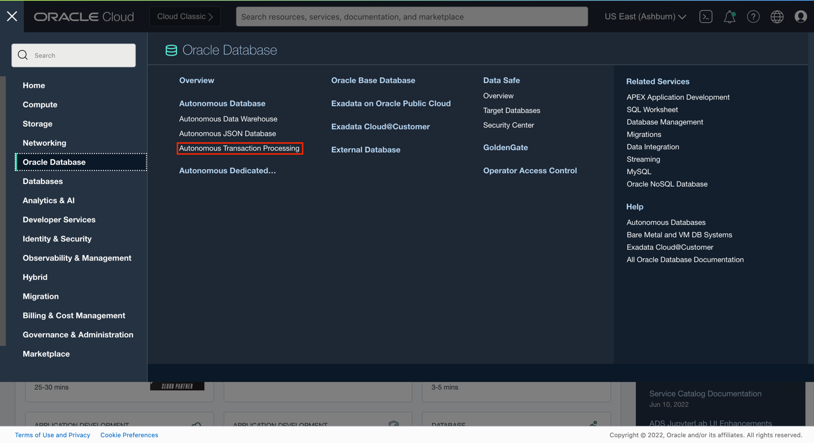

3.  Select the correct compartment (Ex: Care Clinic) and click **Create an Autonomous Database**


4.  Give a prefered Display Name (Ex: CareClinicsDB) and click **Transaction Processing** for the workload type


5.  Create the ADMIN password for the DB, following the database password requirements. Leave everything else as default

    *Note:* Make sure to save this password, you will need it later in this lab


6.  Click **Create Autonomous Database**


7.  Database provisioning will take about 5 minutes. Once the Lifecycle State is ***Available***, you can continue to the next task


## Task 2: Create an APEX Workspace
1.  Under Tools, click **Oracle APEX**


2.  Enter ADMIN password (Step 5) and sign in


3. Create a new Workspace


4. Create a Database User and new password for this user (Ex: CareClinic)

    *Note:* Make sure to save this database user password, you will need it later

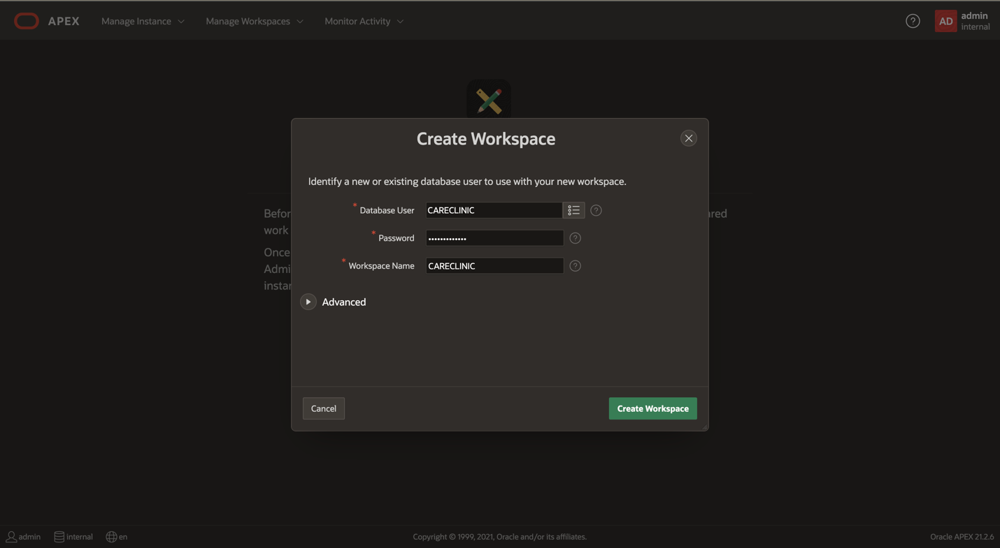

5. After creating the workspace, click **CARECLINIC** to sign out of the admin(internal) workspace and into the workspace that you have just created


## Task 3: Upload Sample Data and Create a new Application

1. Enter password for new dabase user (Ex: CareClinic) and sign into the workspace


2. This is the oracle apex workspace running on inside the database you created. Let's visit the SQL Workshop!


3. Inside the SQL Workshop > Object Browser to view any objects in the databse. 

    *Note:* It should be empty i.e no tables currently in the databse. Uploading a DDL script will create the table structure you need, and then you can inset the data from .csv files


4. Go to SQL Scripts and upload the contents of the <a href="files/Create_Tables.sql">Create\_Tables.sql</a> file. This will build the table structure of the tables required. 


5. Upload the script


6. Once uploaded, run the script


7. Ensure the statements are processed with no errors **REPLACE Screen Capture HERE down**


8. You are now able to view all 8 tables that were just created in the object browser. Now you will need to upload the data into them


9. Click **Load Data** and upload the respective .csv file for HEALTHCARE\_FACILITY. The full data set can be found <a href="files/CareClinicData.zip">here.</a>


10. Repeat this step for 5 more tables (Exclude the PATIENT\_DOCUMENTS and the PATIENT\_INSURANCE tables)

**Note:** After each load, click view table to return to the object browser

­­

11. There should now be data in 6/8 tables


12. Let's create a new application using the Healthcare\_Facility Table


13. Give your application a name, and click create application. You can leave everything else as defult!


14. Run the application and sign in with your database user (Step 11)!


15. These are two sample pages created for you that show the **Health Care Facility** table. Let's click Application 100 and create a page to upload our sample documents to our **Patients Documents** Table


## Task 4: Add Pages to Application

1. Create new Page!

*Note:* This is on version APEX 21.2, 22.1 will look slightly different.


2. Select **Classic Report**


3. Select **Include Form Page** and give both the classic report and form page unique names. Select the source for this report as the **PATIENT\_DOCUMENTS** table

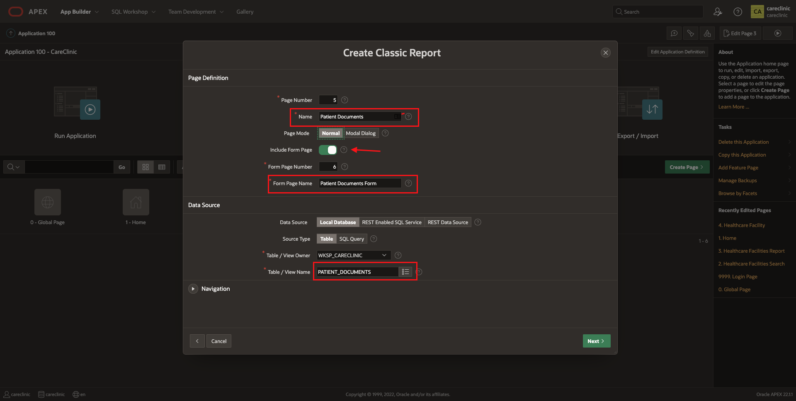

4. Keep the Primary Key Column as ID(Number)


5. Let's hide some columns we do not want showing in the report. You can Ctrl/Cmd+Click these columns and change their type to Hidden Column


6. Select the DOCUMENT Column and in the right side pannel change the **Mime Type**, **Filename Column**, and **Last Updated Column** to match the columns in our **Patient\_Documents** table!

    *Note:* Don't forget to save!


7. You will need to repeat the same steps for the form page (Page 6). Change the unwanted columns to type **Hidden**


8. Select the **P6\_Documents** page item, and change the **MIME Type Column**, **Filename Column**, and **BLOB Last Updated Column**, and Save. 

*Note: *You will need to type these out to match exactly to the database columns.

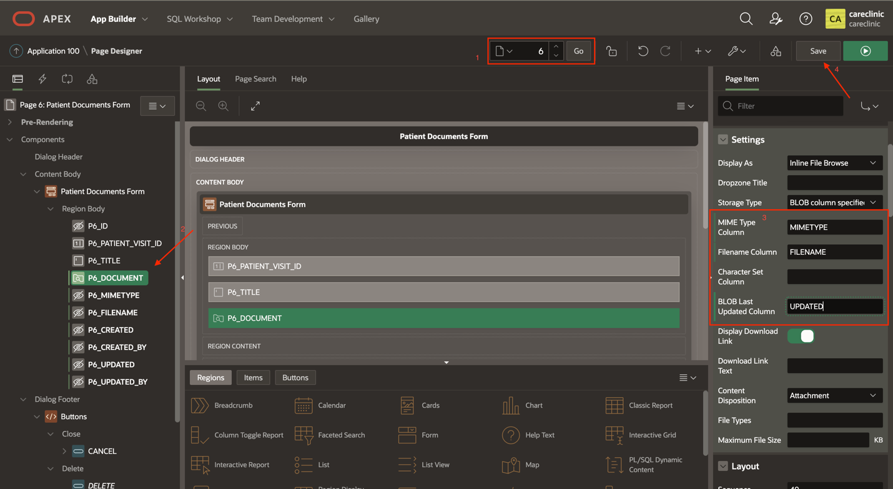

9. Let's create a Popup LOV on our **P6\_PATIENT\_VISIT\_ID**. This will help you assign the correct **Patiend Visit ID** for the documents you are going to upload.


10. Scroll down and change the Type to **SQL Query** and add this code under. 
 
 ```
    <copy>
    Select PV.PATIENT_VISIT_ID || ' - ' || P.FIRST_NAME || ' ' || P.LAST_NAME d, PATIENT_VISIT_ID r from PATIENT_VISIT PV, PATIENT P where PV.PATIENT_ID = P.PATIENT_ID
    </copy>
```


11. Go back to Page 5 and run the application 

    *Note:* Modal Pages cannot be run directly from the page designer, for example Page 6


12. Sign into the application, if prompeted, and click **Create** to inset new record into Patient\_Documents Table. All sample documents can be found <a href="files/Patient_Documents.zip">here.</a>


13. Upload all 6 PDF documents ensuring that the **Patient Visit ID** matches the document name that is being uploaded


14. Now there will be 6 documents in the Patient\_Document Table. 

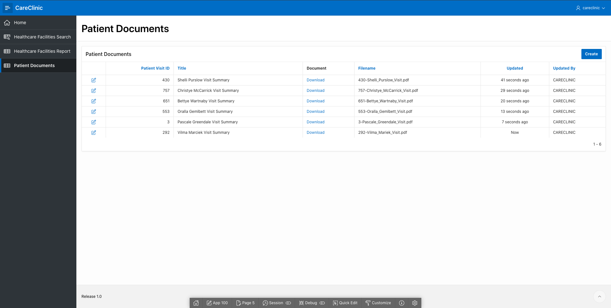

15. This will also be reflected in the SQL Workshop -\> Object Browser -\> Patient\_Document !


## Task 5: Explore Oracle Text

1. Return to the Cloud Console, and inside the ATP you have created, click Database Actions!


2. Click Database Users!


3. Edit the new user you have created!


4. Under Granted Roles, search for "CTX" and check "CTXAPP" and apply changes.!


5. To verify the role was granted, return to Database Actions.!


6. Under Development Click SQL!


7. Execute the query, ensuring to chage the code to match your database user that was created (Step 11)!


8. Return to Database Actions -\> Database Users. Enable REST on the Databse User you created by clicking the more actions and enabling rest!


9. Open a new window by clicking below and sign in with the user that was created (Step 11)!


10. Open SQL Web Developer!

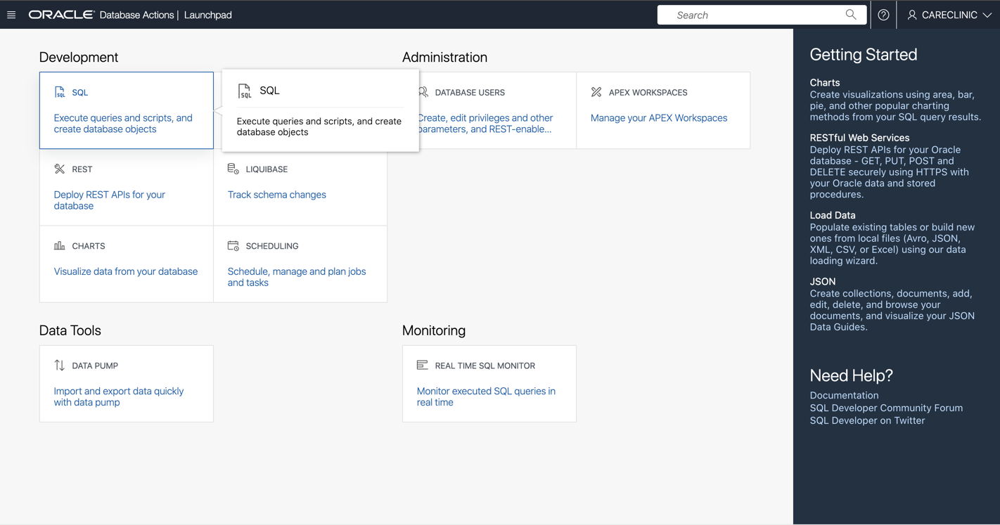

11. Enable REST on both PATIENT and PATIENT\_INSURANCE tables by right clicking them. Leave all settings as defult!

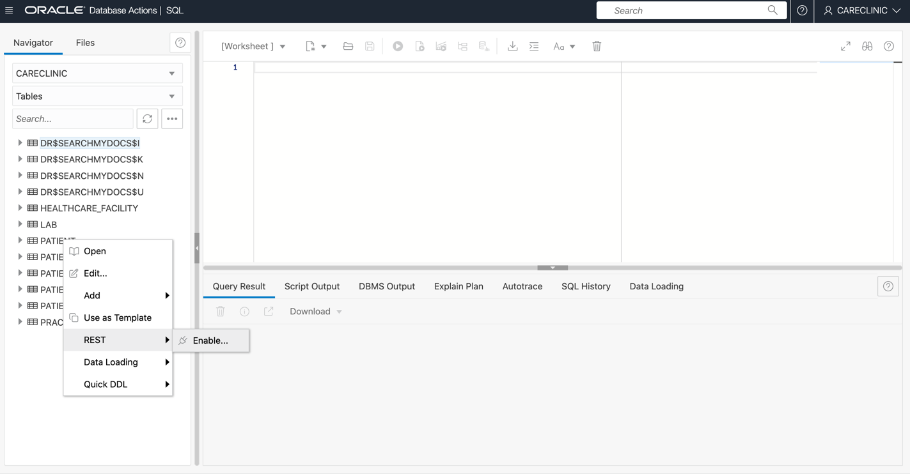

12. Ensure are both enables, you will need this later for the other labs.!

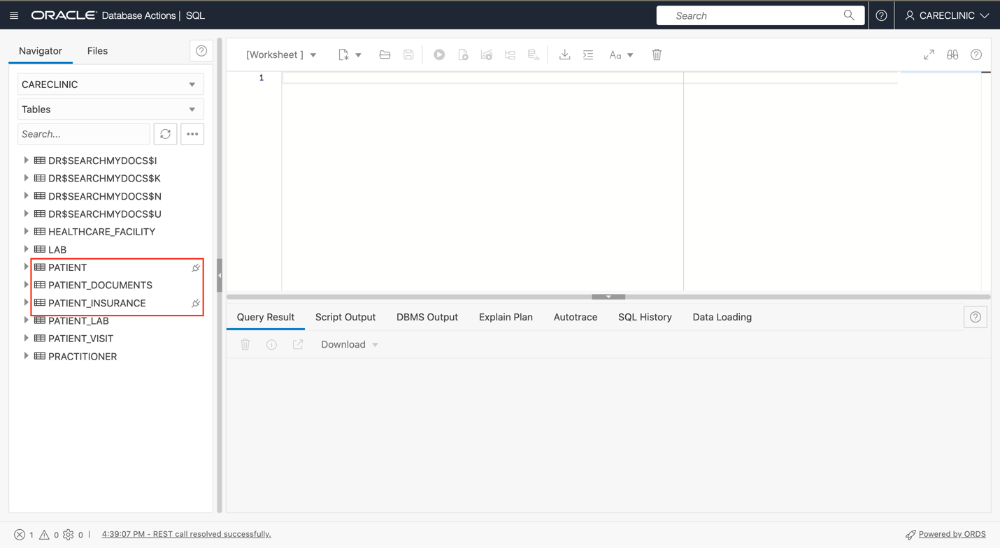

13. Now visit thew APEX workspace. Go to SQL Commands under SQL Workshop!


14. Create an Index on the Patient\_Documents Table, where the visit summaries are stored!


15. Core query inside the document to see if it contains a keyword. In this first example we are looking for all documents who have the work MRN inside the after visit summary. A score greater than 0 means the text is found inside the document.


16. Find all documents that have the word ABC with a score \> 1 and also contains the word Medical Center.!


17. This is a proximity search to look for the word ADULT near the word EXERCISES!


18. Fuzzy Search on a term, this gives the ability to find the work medications in the document without correct spelling. !


19. Soundex Search on a term, giving the ability to find words that sound like the term provided, in this case "pressure". !


20. Stem search on a term. For example if we are looking for documents with that stem of Jounal, then it will return words like Journaling.!


21. Accumulation Search on two or more terms. This is looking for both terms in the document and assigning a score. Higher if both terms are present.!


22. You can also weight each term as seen here. The word phyiscal carries 3x the weight of the work exercises. !


23. Construct Themes Tables: To build themes for your documents you will first need to create a table to hold the themes.Run each statement individually by highlingting the the statement then clicking Run.!


24. Create Themes index for the documents currently in the PATIENT\_DOCUMENTS table.!


25. Query all themes. Show all themes with weight over 25!

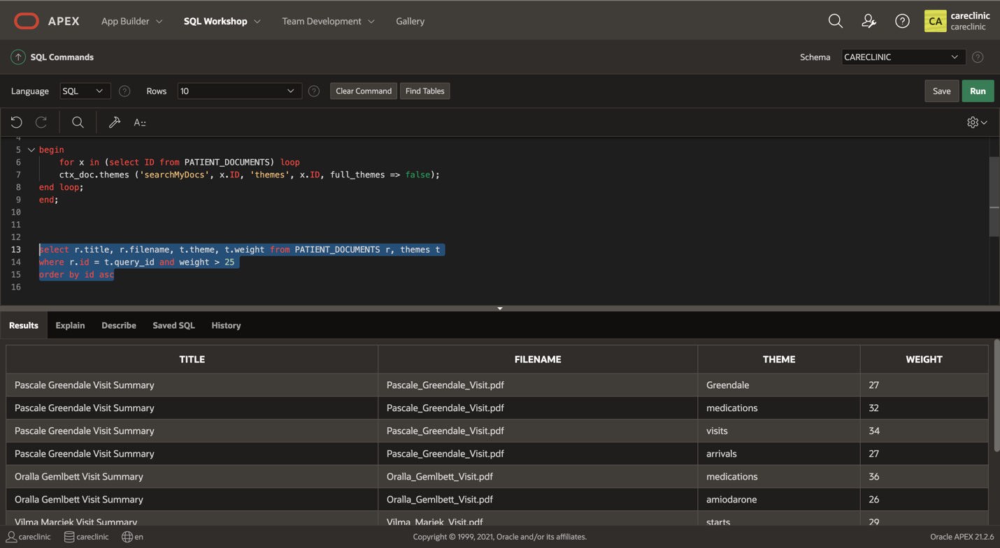

26. Repeat for the Gist Table. Note: Run each of the 3 statements individually. !


27. Repeat for the Filtered Docs Table. Note: Run each of the 3 statements individually. 

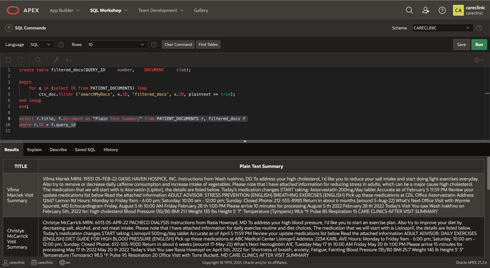

28. Finally repeat for the Full Themes tables. Note: Run each of the 3 statements individually. !


29. We can vertify all 4 tables were created by visitng the Object Browser. !


## Task 6: Implement Oracle Text for End Users

1. Now let's create a new page to let end users view document gists with 1 click. Create Page -\> Report -\> Classic Report!


2. Give the Classic Report a name, and select Modal Dialog (this will allow the page to be a pop-up instead of a redirect)!


3. Finally select the source as SQL Query and enter the query as shown.


4. On the new page, create two page items (P7\_QUERY\_ID and P7\_TITLE) by right-clicking on the content body region. 

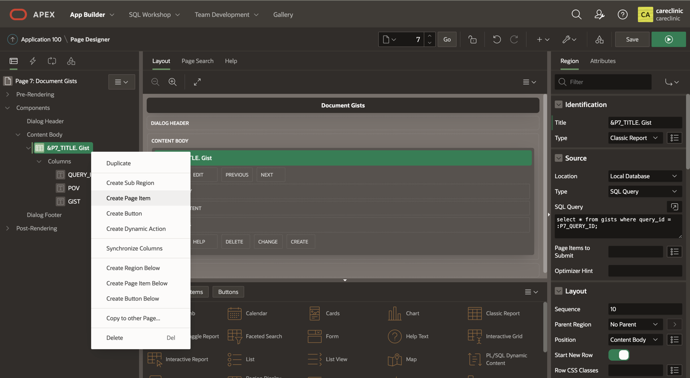

5. Set the Type of both new page items to "Hidden"

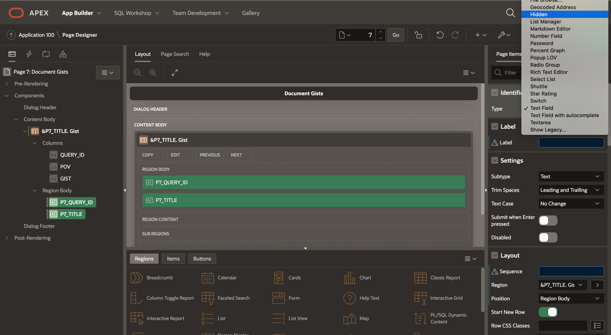

6. Return to page 5. Right-Click Columns and Create Virual Column on this "Report 1"!


7. While Selecting the new virtual column you created, change the Heading to Document Gist. Under Link, click "No Link Defined" to define a new link for this virtual column. Set the link to page 7. Under Set Items, ensure you add both P7\_Query\_ID and P7\_TITLE, with values of \#ID\# and \#TITLE\# respectivly. Note: Use the menu to the right of the text box makes this easier.


8. Add a Link Text by expanding the menu and selecting any of the defult optoions shown.


9. Save and Run the application. Test this new feature by clicking on the pencil icon under Document Gist.


10. You now have a gist of the PDF documents with just one click. Now lets see how we can replicate this to add Fildered Docs in plain text to the table as well.


11. Navigate to Page 7 using the developent tool bar below. Choose the "+" icon and select Page as Copy. Select "Page in this application"!

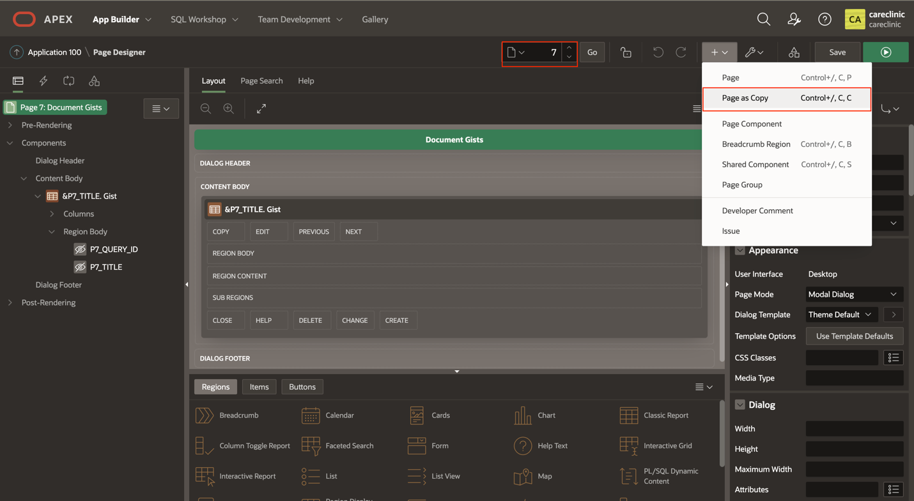

12. Select the new page as page 8, and provide a new page name. On the next page select "Do not associate with a navigation menu entry"!


13. Give the Page Region a new name 


14. You now have a new page (Page 8) where you can alter the SQL query to reflect that of Full Text. Let's create another virtual column link to this page.


15. Save and return to Page 5. Right- Click columns and Create Virtual Column


16. Make changes similar to before, but instead redirecting to Page 8


17. Change the link text to a defult icon. Save and run the page.!


18. By clicking the manifying glass icon we can see the full text for that individual document.!


Congratulations! You have successfully completed this lab.

## Homework: Create a Caledar Page for Patient Appointments  

1. Click Edit App 100 down in the development tool bar. Let's create one more page for our patients appointments.This time we will create a Calandar page


2. Give the new page a name, and select Next. 


3. Select "Create a new nagivation menu entry" and enter a naviagation menu entry name


4. Enter the source as a SQL Query and paste the sql query. Click Next.

```
    <copy>
    select 
        PATIENT_VISIT.DATE_TIME as DATE_TIME,
        PATIENT.FIRST_NAME as FIRST_NAME,
        PATIENT.LAST_NAME as LAST_NAME,
        PRACTITIONER.PRACTITIONER_NAME as PRACTITIONER_NAME,
        HEALTHCARE_FACILITY.FACILITY_NAME as FACILITY_NAME 
    from 
        HEALTHCARE_FACILITY HEALTHCARE_FACILITY,
        PRACTITIONER PRACTITIONER,
        PATIENT PATIENT,
        PATIENT_VISIT PATIENT_VISIT 
    where 
    PATIENT_VISIT.PATIENT_VISIT_ID=PATIENT.PATIENT_ID
    and PATIENT_VISIT.PRACTITIONER_ID=PRACTITIONER.PRACTITIONER_ID
    and PATIENT_VISIT.HEALTHCARE_FACILITY_ID=HEALTHCARE_FACILITY.HEALTHCARE_FACILITY_ID
    </copy>
```

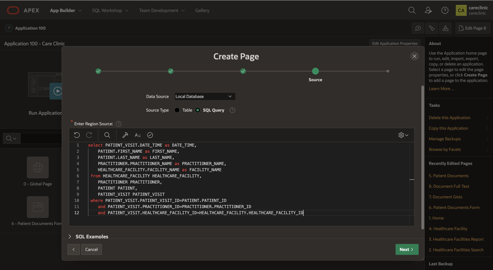

5. For Display Column select Last\_Name, and for Start Data Column select Date\_Time.


6. Lastly under attributed for the Patient Appointments Region. Toggle the **Show Time**, and add some supplemental information for each of the events on the calendar. You may now save and run the application.

```
    <copy>
    <html>
    <body>
    <p>PATIENT: &FIRST_NAME. &LAST_NAME.</p>  
    <p>PRACTITIONER: &PRACTITIONER_NAME.</p>
    <p>FACILITY: &FACILITY_NAME.</p>
    </body>
    </html> 
    </copy>
```


7. Use this navigation to return to the end of 2021/start of 2022 where data already exist in out tables. Note you can hover over the appointments to view the supplemental information that was added about each one. 

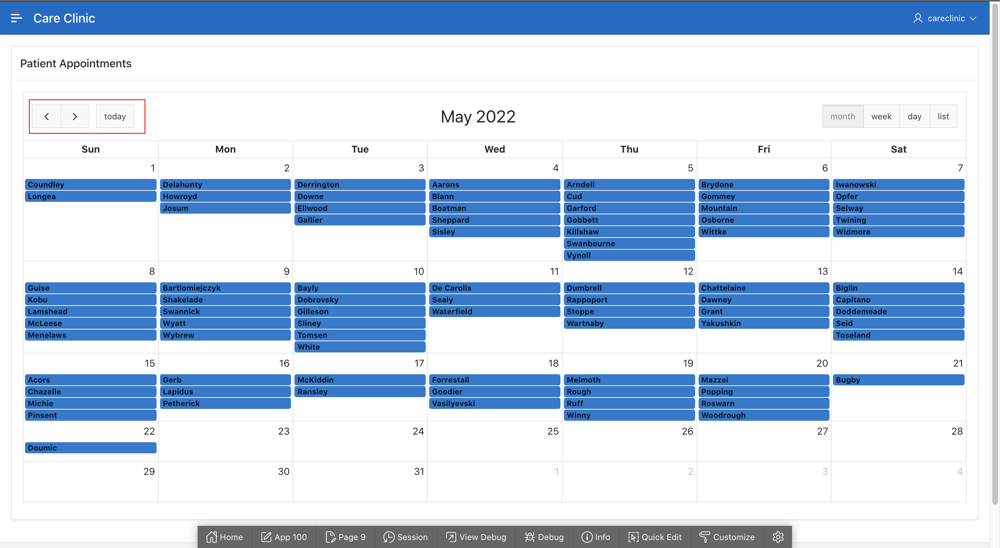

Congratulations! You have successfully completed the homework


