<!-- Updated June 15, 2022 -->

# Provision Visual Builder Cloud Service Instance

## Introduction

This lab walks you through the steps to quickly provision an Visual Builder Cloud Service on Oracle Cloud. In this lab we will create Mobile application which will take photo of ID card and then store it in Object Storage. Further we will also use Vision service to get required detail from the image that user took and store it in Autonomous Database.

Estimated lab time: 2 hours

### Objectives

- Provision a new Visual Builder Cloud Service Instance
- Learn how to connect to your new autonomous database using ORDS and Vision Service.

### Prerequisites

- This lab requires completion of the **Get Started** section in the Contents menu on the left.

## Task 1: Create Visual Builder Cloud Service Instance

1. Log in to the Oracle Cloud at cloud.oracle.com. Cloud Account Name is howarduniversity. Click “Next”.
2. Click on “Direct Sign-In” and enter your Cloud Account email and password.
3. Once you are logged in, you are taken to the cloud services dashboard where you can see all the services available to you. Click the navigation menu in the upper left to show top level navigation choices.
4. Click **Developer Services --> Visual Builder**.

   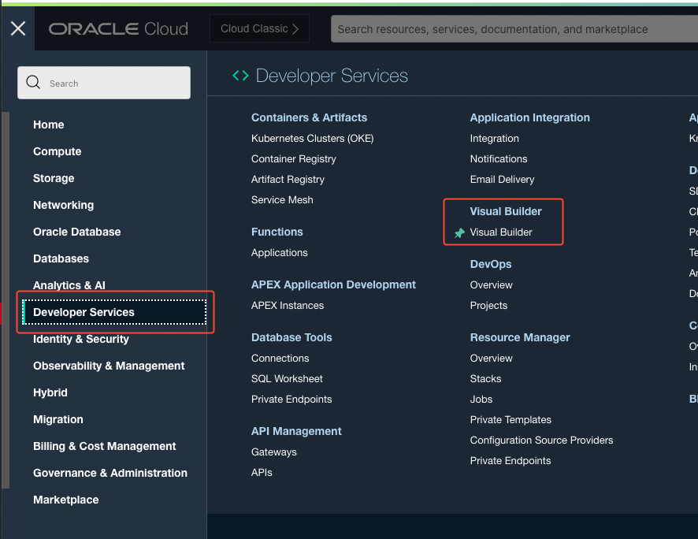

5. Select the **CareClinics** compartment and then click create.

   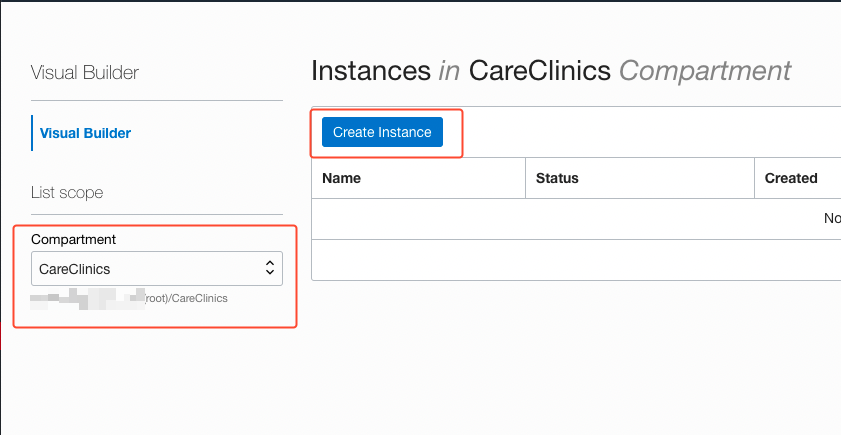

6. Type in the name for your VBCS instance. For example: **CareClinicVB**. Then click create.

   

7. It will take a couple of minutes to create the instance. Once the status changes to active, click on the **Service Homepage** button.

   

8. This will take you to the landing page for Visual builder cloud service. Then click on **New Application** to create an application.

   

9. Enter an application name and click **Finish**. This will create your application and take you to the application builder landing page.

   

## Task 2: Configure Service Connections

In this task, we will create 4 service connections. Prior to creating service connections to OCI services, you first have to get details to generate OCI signature like tenancy OCID, user OCID, fingerprint and key.

### Service Connection Pre-requisite: Build OCI Signature

1. Log in to the Oracle Cloud at cloud.oracle.com. Cloud Account Name is howarduniversity. Click “Next”.
2. Click on “Direct Sign-In” and enter your Cloud Account email and password.
3. Once you are logged in, click on the avatar icon on the top right corner.
   

4. Click on **API Keys** and then Add API Key.
   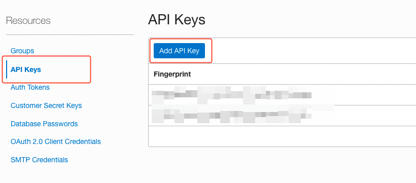

5. Click on **Generate API Key Pair**.
6. Download the keys to your system and store them at a secure location.
7. Click Add.
   

8. Copy the Configuration File Preview and paste this in a notepad text file. We will use this while adding a service connection to OCI services.
   

### Service Connection 1: Object Storage

This is a service connection to the Object Storage Service. We built this bucket in the "Introduction to OCI" workshop. We will need the "namespaceName" & "bucketName" from that lab for later portions of this lab.

Go to this page to know more about Object Storage REST endpoints [Object Storage API](https://docs.oracle.com/en-us/iaas/api/#/en/objectstorage/20160918/Object/PutObject)

We will use following API to upload Object to Object Storage.

```copy
https://objectstorage.us-{region}-1.oraclecloud.com/n/{namespaceName}/b/{bucketName}/o/{objectName}
```

1. Click on **services** in left panel and then click on **plus sign** to add new service connection

   

2. Select Define by Endpoint to add REST endpoints
   

3. Enter the Object Storage URL. Method will be **PUT** since we will uplload image to Object Storage. Click **Next**
   

4. By default you will be in **Overview** tab. Change **Service Name**
   

5. Click on **Server**, under Server Variables change region variable to your region, here we are using ashburn and we will change the authentication to `Oracle Cloud Infrastructire API signature 1.0`
   

6. Click on **pencil icon** to add API key ( < tenancyocid >/< userocid >/< fingerprint >) and Private Key. Click **Save**
   

7. Click on **Request > Body** and change Media Type to `application/octet-stream`
   

### Service Connection 2: ORDS Autonomous Database

This is a service connection to the Autonomous Database. We built this API in the "Oracle Apex and ADW" workshop (REST Apis for POST - Patient_Insurance and GET - Patient tables). No authentication for these APIs.

Repeat the above process to create another service connection to fetch user information.

1. Here we will have get method and hint will be get one. Click **Next**.

   

2. Rename the service if you want and go to test, and enter id value and click on send request. Once we get 200 response, save the example response and then click create.

   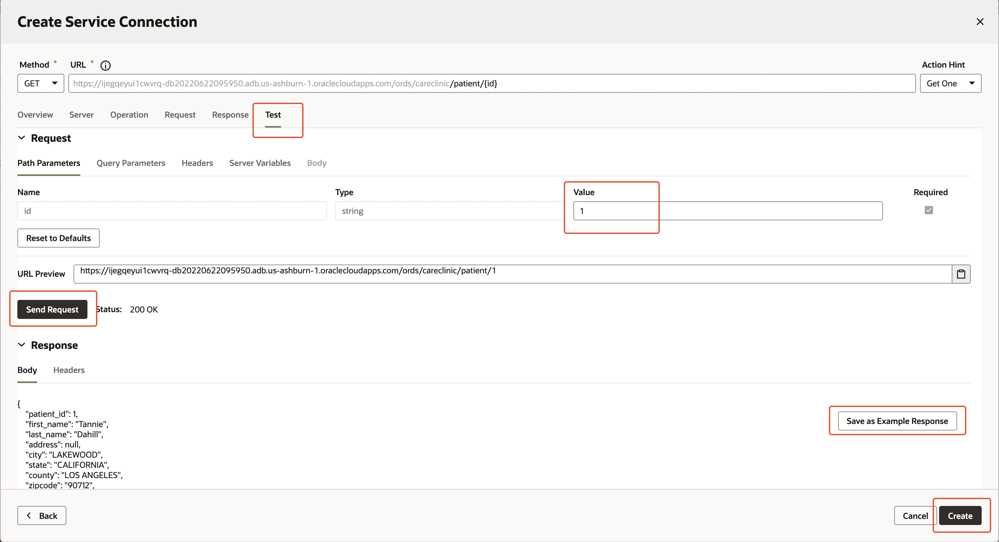

   
   

### Service Connection 3: Vision Service

This is a service connection to the OCI Vision Service. The APIs are available out of the box. OCI Signature is the authentication scheme for these APIs (similar to what we did in Service Connection 1).

Go to this page to know more about OCI Vision REST endpoints [OCI Vision APIs](https://docs.oracle.com/en-us/iaas/api/#/en/vision/20220125/AnalyzeDocumentResult/AnalyzeDocument)

We will use following API to extract text from the insurance cards.

```copy
https://vision.aiservice.us-ashburn-1.oci.oraclecloud.com/20220125/actions/analyzeDocument
```

1. Repeat Steps **1-2** from the "Service Connection 1: Object Storage". Enter the Vision Service URL. Method will be **POST**.

2. Repeat Steps **4-6 for authentication** from the "Service Connection 1: Object Storage". Click on **Request > Body** and paste the following:

```copy
{
     "features" : [ {
    "featureType" : "TEXT_DETECTION"
  } ],
  "language" : "ENG",
      document: {
        source: "OBJECT_STORAGE",
        namespaceName: "EXAMPLE-namespaceName-Value",
        bucketName: "EXAMPLE-bucketName-Value",
        objectName: "EXAMPLE-objectName-Value"
      }
}
```

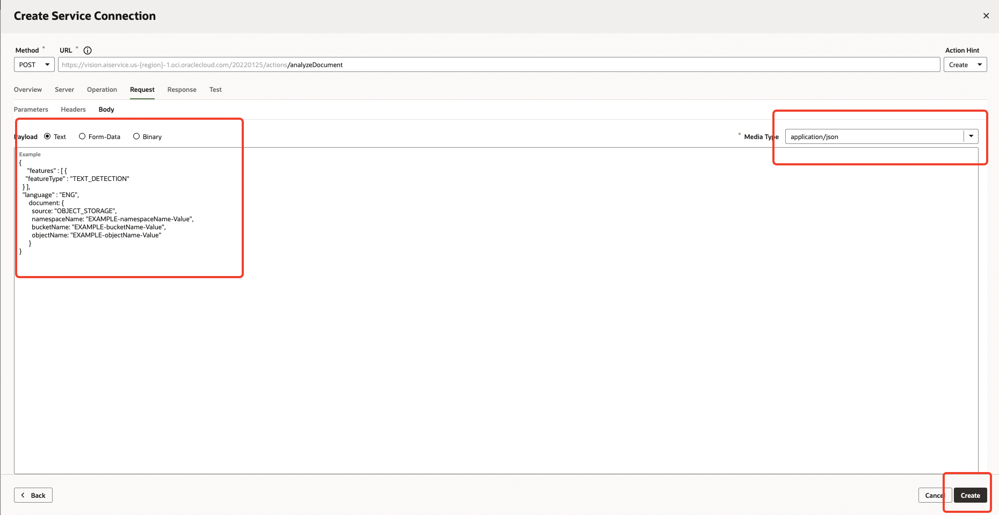

## Task 3: Create Mobile Application

In this task we will now actually create mobile application that end users can interact with.

### Page 1: main-start

1. Click on **Mobile Applications** in left panel and then click on **plus sign**.
   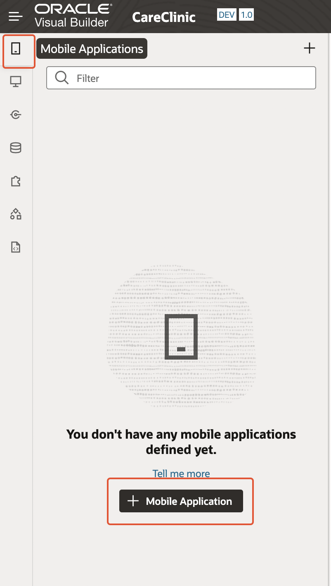

2. Give name to application, select **none** as Navigation Style and click **Next**.
   

3. Click **Custom** as template and Click Create.
   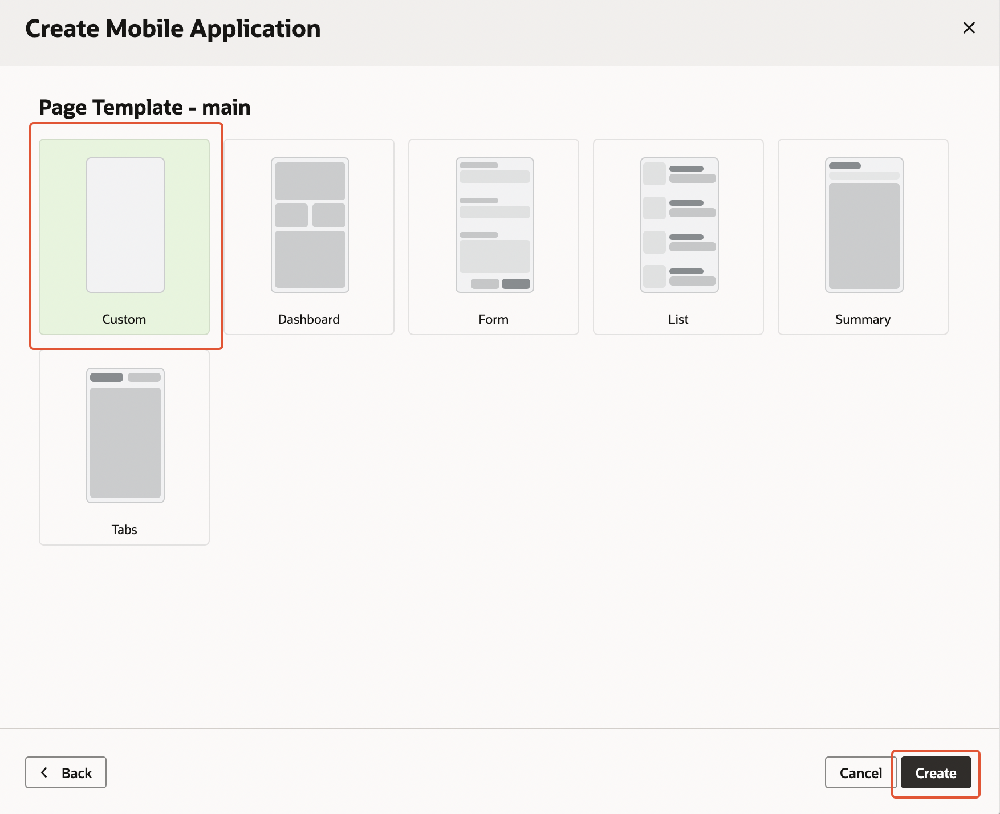

4. Once page is loaded you can see the structure in left panel, by defauly main-start is landing page. In canvas you can see components where we can filter different components and drag and drop in our canvas. Also elements in canvas can be seen under structure.

   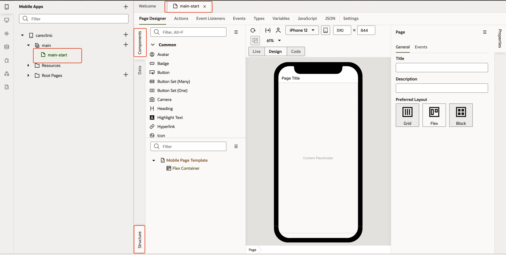

5. Search for input and drag and drop to Input Text to canvas
   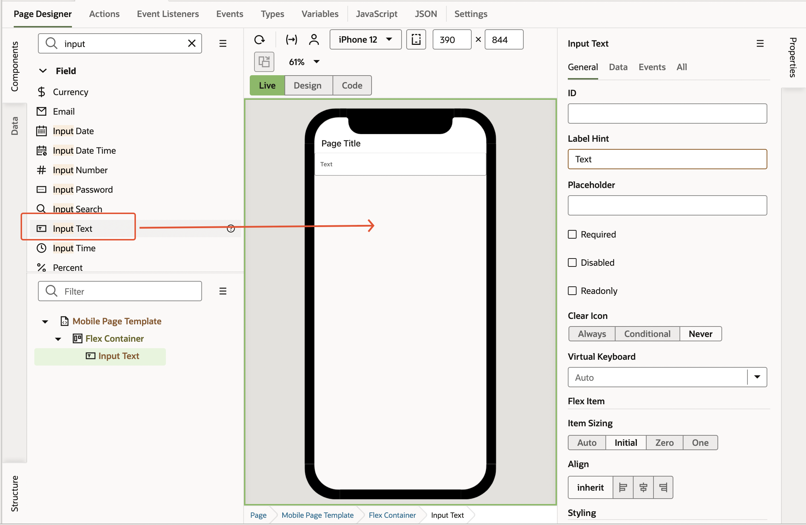

6. On right hand side under properties, rename **Label hint** to Enter Id and check the required field. Also add class of `oj-sm-padding-5x` which make it look bit nicer.
   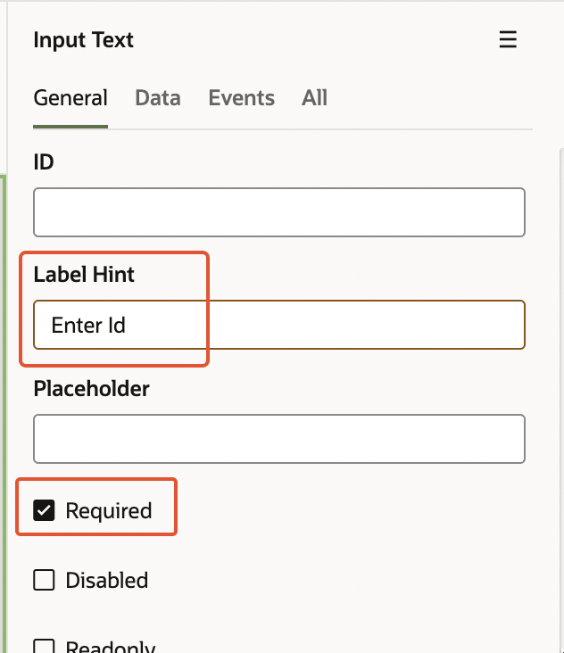
   

7. Repeat the same process to add Button.

8. Under structure, click on **Flex Container** and then under properties click on **Center** in Justify and again **Center** in Align
   

9. Click on Input Text and then under **Properties** go to **Data** and next to value click on **down arrow** and finally click **Create Variable**

   

10. Give variable name and then click **Create**
    

11. Click on Button and then under events in Properties click on New Event and on ojAction.
    

12. This will take you to Action page and create new action rename ID to `LoginButtonActionChain` and then drag and drop Call REST to canvas
    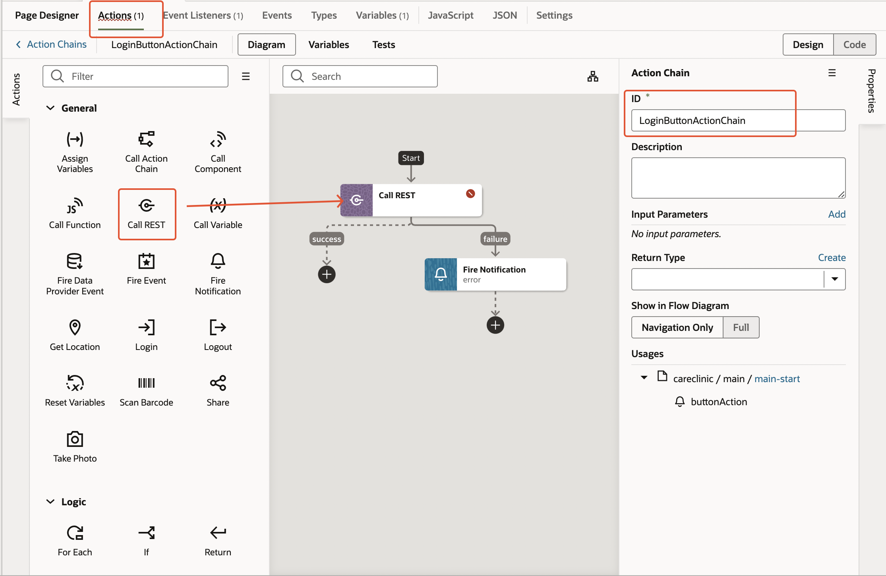

13. Select Call Rest and under Properties click on Select next to Endpoint
    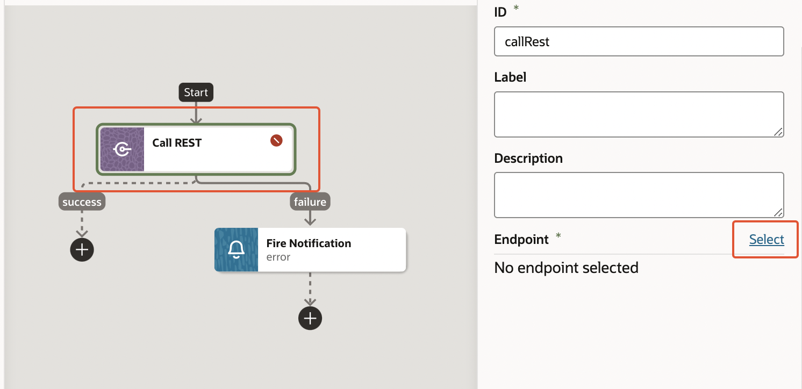

14. Select getUser endpoint and click Select.
    

15. Under Properties now you should see Input Parameters and click on Assign
    

16. Drag userId from Sources to id under Target.
    

17. Now if our REST call is success we want to Navigate to other page, fo that drag and drop Navigate. Under Properties click Create next to Page.
    

18. Give name to page and select Custom, click Create.
    

### Page 2: main-cardImage

1. In the left navigation pane, find the newly created page and click on "main-cardimage".
   

2. In the main-cardpage, go to **types** and click on +type and then "From Endpoint".
   

3. Select the getUser under services.
   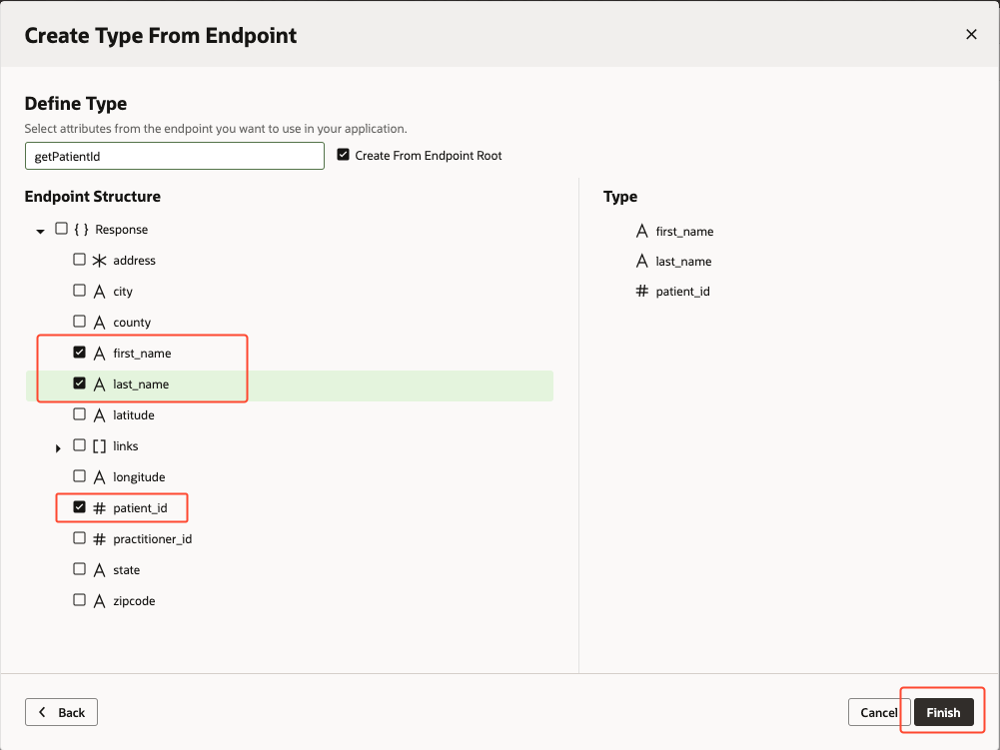

4. Select the fields you want the type to have, in this example we are going to display only the first and last name but we also need the id for the REST calls to update the database table. Therefore select those three fields.  
   
5. Then go to **Variables** and click "+Variable", name it **userDetails** and select the type as the one you created in step 4. Then click create. Create another variable "image" of type Any.  
   
   

6. Choose the option "Required" under the input parameters on the right side of the screen.
   

7. Go back to the "main-start" page and open the action chain that will be called on click of the login button. Click on the "navigate to main-cardimage" activity. You should now see under input parameters the newly created input paramater for main-cardimage page i.e. userDetails. Click on Assign.
   

8. Assign the userDetails on the right side the following code:

`{ "patient_id": $chain.results.callRestGetPatientId.body.patient_id, "first_name": $chain.results.callRestGetPatientId.body.first_name, "last_name": $chain.results.callRestGetPatientId.body.last_name }`

Then click Save.

Note: callRestGetPatientId could be different for you if you changed the rest call id step right above the navigate step. The idea is to assign the returned fields from the rest call to your next page's input parameter.


9. Go back to your "main-cardimage" page, drag and drop a form layout to the canvas.
10. Also add **oj-sm-padding-4x-horizontal** class on the right side properties panel.
    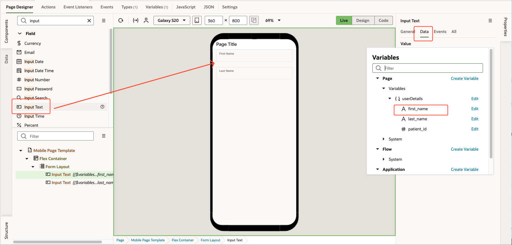

11. Next drag and drop an "Input Text" inside the form layout and on the right properties panel goto data.
12. For the value field under the data tab, hover over the field and you will see an arrow on the far right. Click on that arrow and select "first_name" under the userDetails variable.
13. Repeat step 12 for the "Last Name" field.
    

14. Drag and drop a camera component under the form layout in the canvas. In the properties panel on the right, deselect video as the app will only accept images. Also align it centrally.
    

15. Then in the properties panel, go to "events" tab and click on "+New Event" and select "On Selected Files". This will open up an action chain.
    

16. Drag and drop an assign varibale option to the canvas. Then click Assign.
    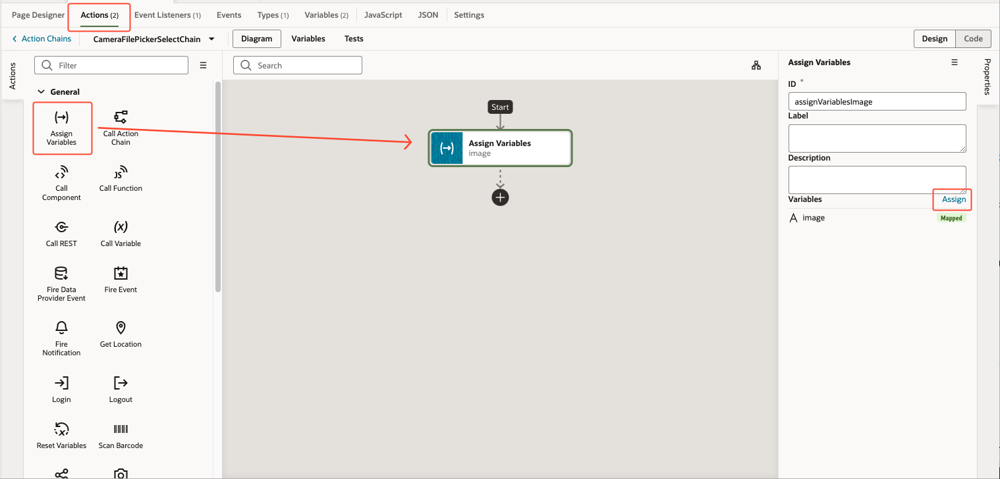

17. From the left assign Files.item[0] to the image variable and make sure to select expression and click save.
    

18. After the assign variable, drag and drop a "fire notification activity" and in the properties panel on the right update the details accordingly.  
    

19. //TO-DO The whole upload action chain:
    - upload to object storage
    - call vision API
    - Parse the response
    - call DB API to create record in DB.
    - navigate to main-success in case of success.


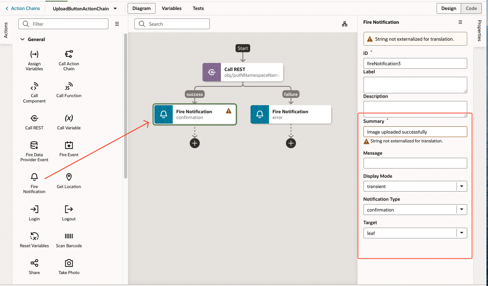
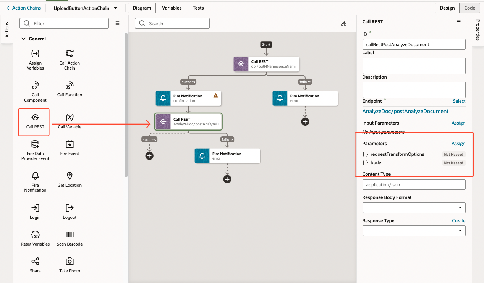
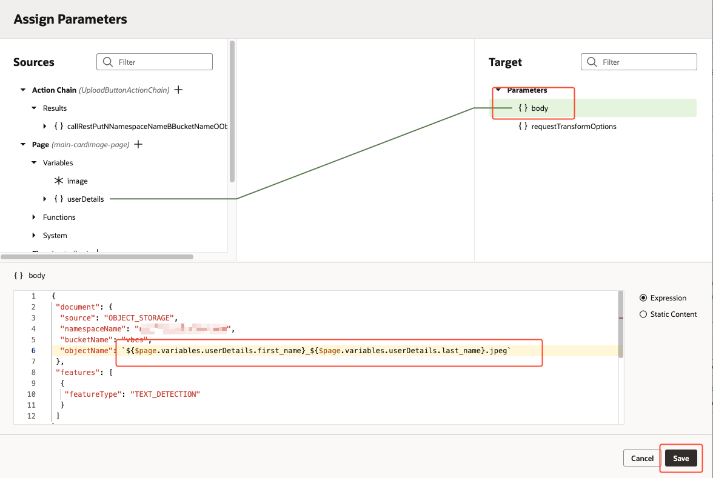


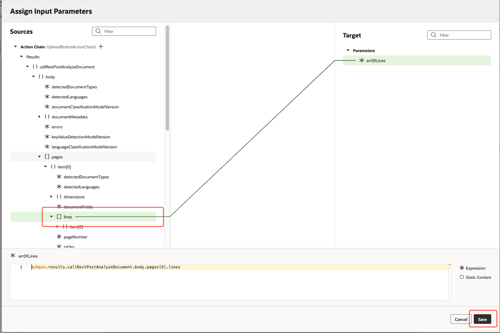
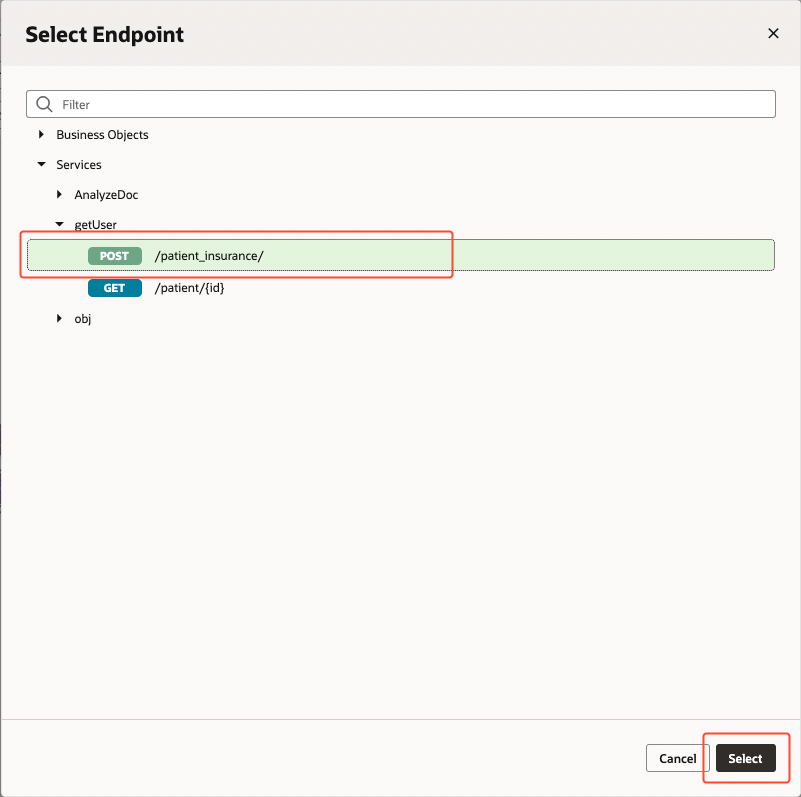

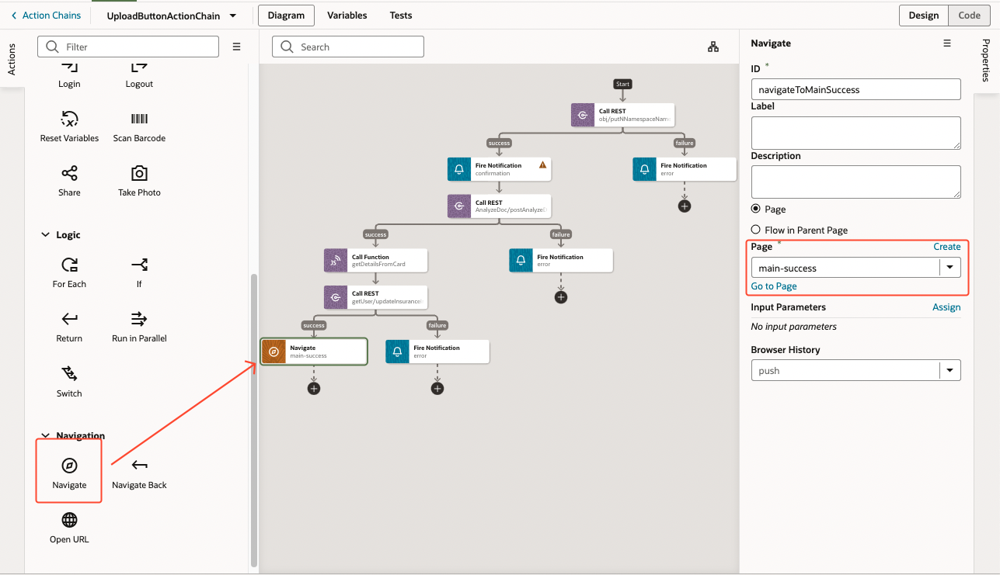

### Page 3: main-success

1. Click on Flex Container and on the right properties panel, select the following:
   

2. Drag and drop a icon component onto the canvas and click on the icon option in the properties panel.
   

3. Search for success and select the "Success S" option and then click on select.
   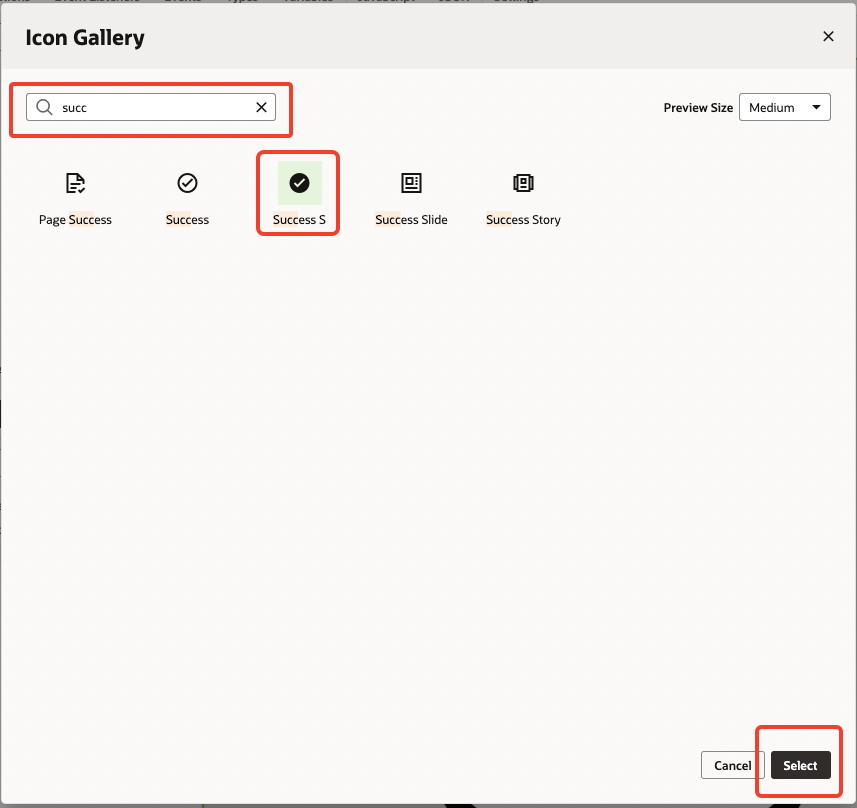

4. Add the **oj-icon-color-success** class to the icon.
   

5. Go to the "All tab" for the icon properties and then search for style. Then add "font-size:100px;".
   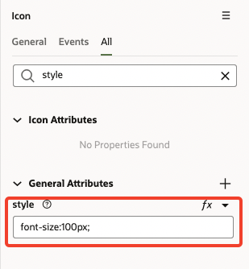

6. Drag and drop a text right under the icon component.
7. Change the value to "Success! You can now return to the Chatbot"
   

## Task 4: Publish Application and test

## Troubleshoot Tips

    If you are having problems with any of the labs, please visit the Need Help? tab.
