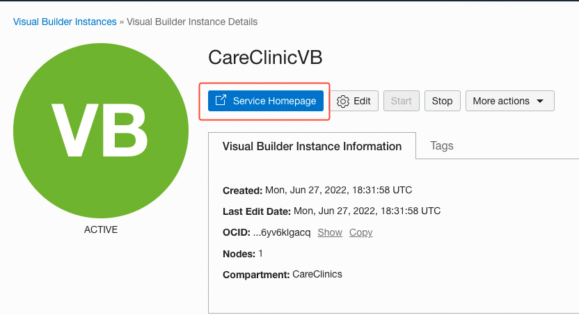
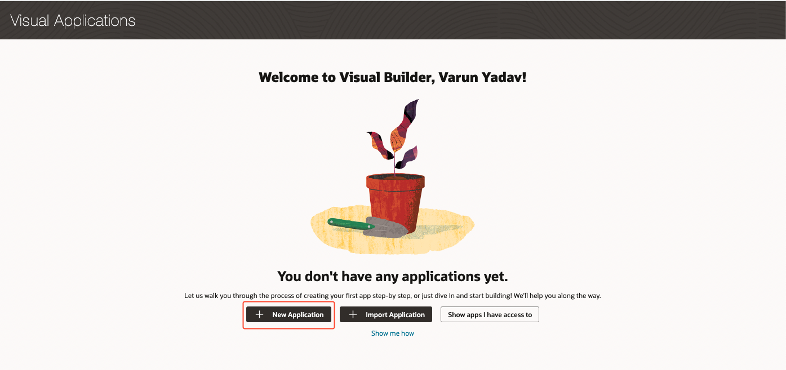
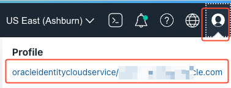
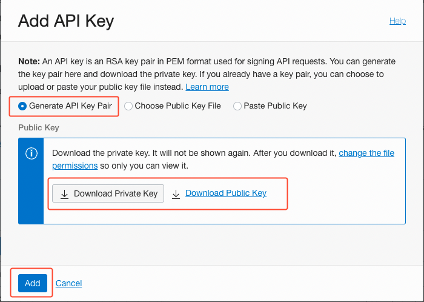
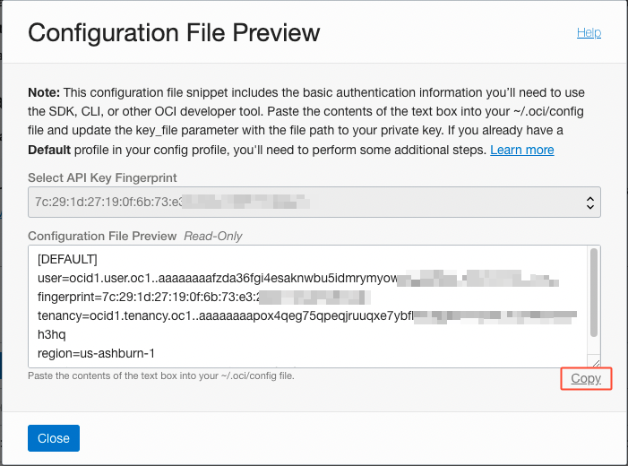
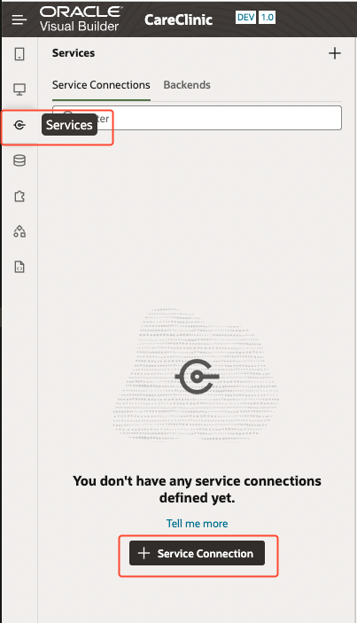

<!-- Updated June 15, 2022 -->

# Provision Visual Builder Cloud Service Instance

## Introduction

This lab walks you through the steps to quickly provision an Visual Builder Cloud Service on Oracle Cloud. In this lab we will create Mobile application which will take photo of ID card and then store it in Object Storage. Further we will also use Vision service to get required detail from the image that user took and store it in Autonomous Database.

Estimated lab time: 2 hours

### Objectives

- Provision a new Visual Builder Cloud Service Instance
- Learn how to connect to your new autonomous database using ORDS and Vision Service.

### Prerequisites

- This lab requires completion of the **Get Started** section in the Contents menu on the left.

## Task 1: Create Visual Builder Cloud Service Instance

1. Log in to the Oracle Cloud at cloud.oracle.com. Cloud Account Name is howarduniversity. Click “Next”.
2. Click on “Direct Sign-In” and enter your Cloud Account email and password.
3. Once you are logged in, you are taken to the cloud services dashboard where you can see all the services available to you. Click the navigation menu in the upper left to show top level navigation choices.
4. Click **Developer Services --> Visual Builder**.

    

5. Select the **CareClinics** compartment and then click create.

    

6. Type in the name for your VBCS instance. For example: **CareClinicVB**. Then click create.

    

7. It will take a couple of minutes to create the instance. Once the status changes to active, click on the **Service Homepage** button.

    

8. This will take you to the landing page for Visual builder cloud service. Then click on **New Application** to create an application.

    

9. Enter an application name and click **Finish**. This will create your application and take you to the application builder landing page.

    


## Task 2: Configure Service Connections

In this task, we will create 4 service connections. Prior to creating service connections to OCI services, you first have to get details to generate OCI signature like tenancy OCID, user OCID, fingerprint and key.

### Service Connection Pre-requisite: Build OCI Signature

1. Log in to the Oracle Cloud at cloud.oracle.com. Cloud Account Name is howarduniversity. Click “Next”.
2. Click on “Direct Sign-In” and enter your Cloud Account email and password.
3. Once you are logged in, click on the avatar icon on the top right corner.
    

4. Click on **API Keys** and then Add API Key.


5. Click on **Generate API Key Pair**.
6. Download the keys to your system and store them at a secure location.
7. Click Add.


8. Copy the Configuration File Preview and paste this in a notepad text file. We will use this while adding a service connection to OCI services.



### Service Connection 1: Object Storage




### Service Connection 2: Vision Service

### Service Connection 3: ORDS Autonomous Database

[OCI Rest APIs](https://docs.oracle.com/en-us/iaas/api/)

[Object Storage API](https://docs.oracle.com/en-us/iaas/api/#/en/objectstorage/20160918/Object/PutObject)

```
https://objectstorage.us-{region}-1.oraclecloud.com/n/{namespaceName}/b/{bucketName}/o/{objectName}
```

## Task 3: Create Mobile Application

## Task 4: Publish Application and test

## Troubleshoot Tips

    If you are having problems with any of the labs, please visit the Need Help? tab.
