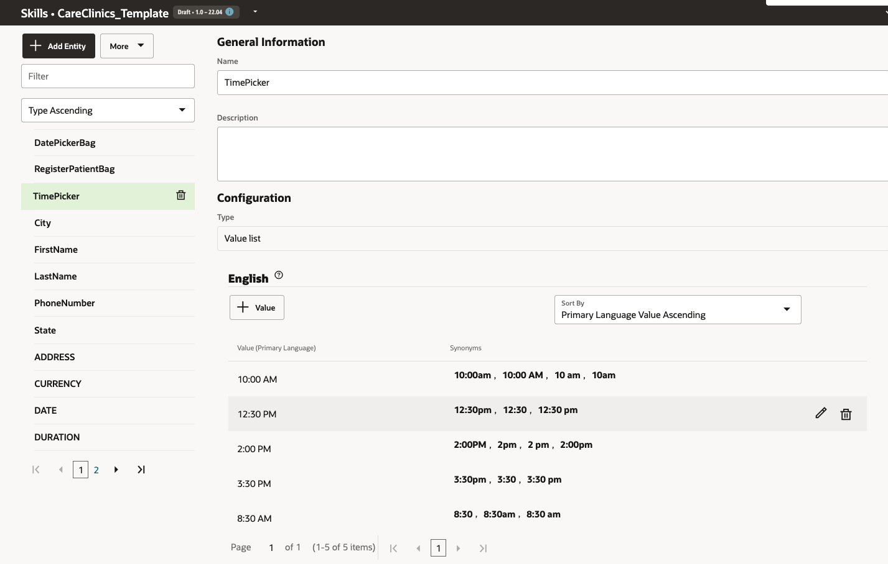
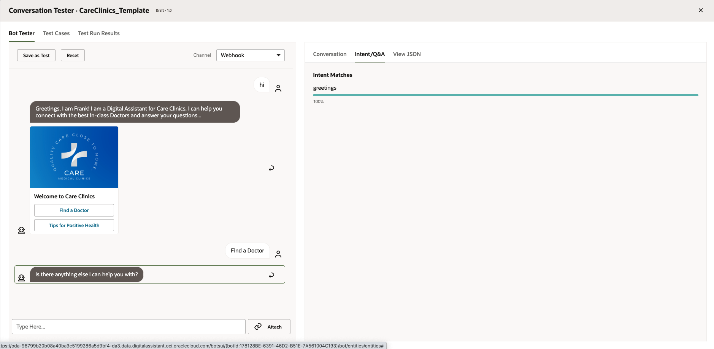
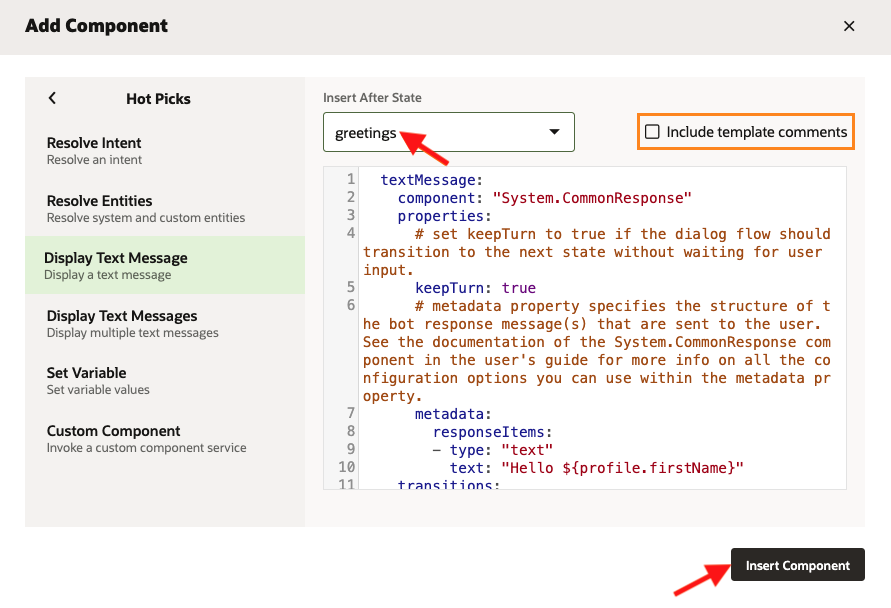

# Build a Digital Assistant
## Introduction

In this lab, we will build a Digital Assistant for patients to schedule an appointment online with the Doctor.

Estimated Time: 2 hours
### Objectives

In this lab, you will:

- Create a skill, define intents, utterances, entities.
- Design a conversation flow.
- Create a custom component to update the database from the chatbot.
- Validate, debug and test your skill.

## Pre-requisites 


Before we get started:

- Download the Skill template - <a href="files/CareMedicalClinics.zip">download</a> 

- Install your favorite IDE (VScode - preferable)

- Install NodeJS in your local machine.


(Add documentation - ORDS)

## Task 1: Create a Digital Assistant Instance and Import the Skill
1. Log in to the Oracle Cloud at cloud.oracle.com. Cloud Account Name is howarduniversity. Click “Next”.
2. Click on “Direct Sign-In” and enter your Cloud Account email and password.
3. Once you are logged in, you are taken to the cloud services dashboard where you can see all the services available to you. Click the navigation menu in the upper left to show top level navigation choices.
4. Click **Digital Assistant**

  

5. Select the CareClinics compartment and create a Digital Assistant instance. 

  

6. After the instance is successfully created. Click on the Service Console to open the ODA console. 

  

7. Now, select the navigation on the top left menu, select Skills under Development and import the Skill which you downloaded.

  

## Task 2: Create and test an intent
Oracle Digital Assistant's underlying natural language processing (NLP) engine doesn't inherently know about the business or task that a skill is supposed to assist with. For the skill to understand what it should react to, you need to define intents and examples (utterances) for how a user would request a specific intent.

You will create intents for finding a doctor and positive health therapy tips. 

Create the Find a Doctor intent: 

1. Click the + Intent button.
2. Next to the Conversation Name field, click the Edit button, and enter *Find Doctor*.
3. In the Name field, type *findDoctor*.
4. Select and copy all of the example sentences below to your clipboard and paste in the *Advance Input Mode* section under Examples

    ```
    <copy>
    find a doc
    help from doctor
    how can I find the doctor?
    looking for a doctor
    need doctor assistance
    Where is the doc?
    </copy>
    ```

    (You'll notice that it's fine for utterances to have inconsistent punctuation and capitalization.)
5. Click the +Create button.

  

### Create the Positive Health intent:

1. Click the + Intent button.
2. Next to the Conversation Name field, click the Edit button, and enter *Positive Health*.
3. In the Name field, type *positiveHealth*.
4. Select and copy all of the example sentences below to your clipboard and paste in the *Advance Input Mode* section under Examples

    ```
    <copy>
    health tips
    mental health treatment
    need positive health tips
    positive outlook
    mental health therapy
    </copy>
    ```
5. Click the +Create button.

### Create the Unresolved intent:
The unresolved intent in a skill handles messages outside of the domain that a skill is designed to process. For this you usually map a dialog flow state to the *unresolvedIntent* action transition to inform the user that the skill could not handle the request.

1. Click the + Intent button.
2. Next to the Conversation Name field, click the Edit button, and enter *Unresolved Intent*.
3. In the Name field, type *unresolvedIntent*.
4. Select and copy all of the example sentences below to your clipboard and paste in the *Advance Input Mode* section under Examples
    ```
    <copy>
    blah blah
    buy me a tv
    play music
    sing a song
    </copy>
    ```
5. Click the +Create button.


### Train and test the intents:

You've now provided the basic ingredients that allow the skill to recognize user input for both the intents. Currently, the skill can't understand any user input.

To enable the skill to interpret user input based on the utterances that you just added, you need to train to build the intent model.

1. On the right side of the page, locate and click the Train. Select *Trainer Ht* and then click *Submit*.

  

2. Let's perform a quick test in the utterance tester.

  

  Go ahead and test your own utterances and train your bot.

## Task 3: Create entities

Now it's time to add entities, which detect information in the user input that can help the intent fulfill a user request. We will be creating entities with regular expression, value lists and add them to a composite bag. 


1. In the left navigation for the designer, select the Entities icon.
2. Click + Add Entity to create a new entity.
3. In the Name field, change the value to *FirstName*.
4. Select the Configuration type as *Regular Expression* and value as [a-zA-Z]+
  
5. Click the Create button
6. Follow the same steps for entities:  
    - *Last Name* (Name - LastName, type - Regular Expression, Value - [a-zA-Z]+)
    - *PhoneNumber* (Name - PhoneNumber, type - Regular Expression, Value - ^[\+]?[(]?[0-9]{3}[)]?[-\s\.]?[0-9]{3}[-\s\.]?[0-9]{4,6}$)
    - *State* (Name - State, type - Regular Expression, Value - [a-zA-Z]+)
    - *City* (Name - City, type - Regular Expression, Value - [a-zA-Z]+)

Create a Value List Entity

1. Click + Add Entity to create a new entity.
2. In the Name field, change the value to *TimePicker*.
3. In the Configuration section, select *Value list* from the Type menu.
4. Click + Value.
For Value, type *10:00 AM*.
For Synonyms, type *10am*, then click Enter. Type 10:00am, and then click Enter again.<br/> <br/>
Here are the list of values and synonyms:<br/>
8:30 AM	- 8:30, 8:30am, 8:30 am <br/>
10:00 AM - 10am, 10:00am, 10:00 AM, 10 am <br/>
12:30 PM - 12:30pm, 12:30, 12:30 pm <br/>
2:00 PM	- 2:00 pm, 2 pm, 2pm, 2:00pm <br/>
3:30 PM	- 3:30pm, 3:30, 3:30 pm <br/>

Click Create.
  

5. Repeat the above steps to create another value list for the *Provider*. <br/>

    Name: Provider <br/>
    Configuration: Value List <br/>
    Values: <br/>
    Dermatology	- Dermatology, derma <br/>
    Family Medicine	- FamilyMed, family medicine, family med <br/>
    Obstetrics and gynecology - ob gyn, ob-gyn, gyn, ob <br/>
    Pediatrics - pediatric, pediatrics <br/>
    Primary care - primarycare, primcare <br/>
    Other - something else, somethingelse, other, others, not here <br/>

  

Create a Composite Bag Entity

In this step, you're going to simplify your development efforts using a composite bag entity, which enables you to manage the multiple entities that you just created as a consolidated entity. In addition to unifying your entities, the various composite bag properties enable your skill to match entity values in complex, real-world scenarios that involve erratic user input.

7. Click + Add Entity to create a new entity with the name *RegisterPatientBag* and select the Configuration type as *Composite Bag*.
  
8. Select the *RegisterPatientBag* and add a *+ Bag Item*.
  
9. Enter the Name as *FirstName*, select the type as *Entity* and Entity name as *FirstName* from the drop down.
  
10. Turn off *Prompt for Disambiguation* and *Out of Order Extraction* toggle button and add the following *prompts*:

    ```
    <copy>
    Enter first name
    </copy>
    ```
    ```
    <copy>
    Invalid name, please re-enter your first name (Ex: John)    
    </copy>
    ```
  
11. Click the close button.
12. Add *+ Bag Item* for Last Name.<br/>
    Name: LastName
    Type: Entity
    Entity Name: LastName
    Turn off *Prompt for Disambiguation* and *Out of Order Extraction* toggle button
    Prompts: 

    ```
    <copy>
    Enter your last name
    </copy>
    ```
    ```
    <copy>
    Invalid name, please re-enter your last name (Ex: Smith)  
    </copy>
    ```
13. Add *+ Bag Item* for Phone Number.<br/>
    Name: PhoneNumber
    Type: Entity
    Entity Name: PhoneNumber
    Turn off *Prompt for Disambiguation* and *Out of Order Extraction* toggle button
    Prompts: 

    ```
    <copy>
    Enter your phone number
    </copy>
    ```
    ```
    <copy>
    Enter the phone number in the following format (Ex: 562XXXXXXX/+9198666XXXXX/555-XXX-XXXX)) )
    </copy>
    ```
    ```
    <copy>
    Invalid number, Please try again
    </copy>
    ```

14. Add *+ Bag Item* for Street Address.<br/>
    Name: StreetAddress
    Type: Entity
    Entity Name: Address
    Turn off *Prompt for Disambiguation* and *Out of Order Extraction* toggle button
    Prompts: 

    ```
    <copy>
    Enter your street address
    </copy>
    ```
    ```
    <copy>
    Enter a valid street address (Ex: 2300 Cloud Way)
    </copy>
    ```

      
      
      
15. Add *+ Bag Item* for City.<br/>
    Name: City
    Type: Entity
    Entity Name: City
    Turn off *Prompt for Disambiguation* and *Out of Order Extraction* toggle button
    Prompts: 

    ```
    <copy>
    Enter your city
    </copy>
    ```
    ```
    <copy>
    Invalid city, please re-enter your city name (Ex: Austin)
    </copy>
    ```
16. Add *+ Bag Item* for State.<br/>
    Name: State
    Type: Entity
    Entity Name: State
    Turn off *Prompt for Disambiguation* and *Out of Order Extraction* toggle button
    Prompts: 

    ```
    <copy>
    Enter your State
    </copy>
    ```
    ```
    <copy>
    Invalid entry, please enter the state you reside in (Ex: Texas)
    </copy>
    ```
17. Add *+ Bag Item* for Zipcode.<br/>
    Name: Zipcode
    Type: Entity
    Entity Name: Number
    Turn off *Prompt for Disambiguation* and *Out of Order Extraction* toggle button
    Prompts: 

    ```
    <copy>
    Enter your zip code
    </copy>
    ```
    ```
    <copy>
    Invalid code, please try again (Ex: 78741)
    </copy>
    ```
18. Add *+ Bag Item* for Location.<br/>
    Name: Location
    Type: Location
    Turn off *Prompt for Disambiguation* and *Out of Order Extraction* toggle button
    Prompts: 

    ```
    <copy>
    Upload your location
    </copy>
    ```


19. Now, Let's create another Composite bag for Date Picker. 

- Click + Add Entity to create a new entity with the name *DatePickerBag* and select the Configuration type as *Composite Bag*.

- Add *+ Bag Item* for *dateEntry*.
<br/>
    Name: dateEntry
    Type: Entity
    Entity Name: DATE

      

    Ambiguity Resolution Rule: 
    <br/>
    Switch on toggle - Consider End User Locale
    Default Date Format - MM/DD/YY
    Resolve Date as *Default* in intents
      
    Prompts: 

    ```
    <copy>
    Select your preferred date of appointment
    </copy>
    ```
    ```
    <copy>
    Please enter the date in the proper format
    </copy>
    ```

20. We will create another composite bag entity

- Click + Add Entity to create a new entity with the name *TimePickerBag* and select the Configuration type as *Composite Bag*.

- Add *+ Bag Item* for *TimePicker*.
<br/>
    Name: dateEntry
    Type: Entity
    Entity Name: TimePicker

      

    Prompts: 

    ```
    <copy>
    Select your preferred time slot
    </copy>
    ```

*Note:* Ensure that all the entities are trained.


## Task 4: Create a Dialog Flow

With the NLP model created, you are ready to build a dialog flow for the skill. The dialog flow is a blueprint for the interactions that enable the conversation between the skill and the user. Although you're going to create a single flow in this tutorial, a skill can have multiple flows that support different use cases and functions.

Each flow is made up of one or more states, and each state executes a function: rendering a skill response message, authenticating a user, branching the conversation when certain conditions are met, etc. The Visual Flow Designer provides you with templates for each state.

Let's test the current dialog flow

1. Go ahead and click the preview button to test the current flow.

  

2. Start the conversation by typing *Hi* and observe the states and intents in the conversation tester  window.

  

  


Start building the dialog flow

Each state implemented by a
component
– Executes logic
– Receives user input
– Returns bot responses
– Determines navigation

1. Go ahead and replace *System.intent* component. This will allow you to conditionally direct a conversation to a logical next dialog flow state for each user utterance.  
  ```
  <copy>
  ########### System intent ###############
    intent:
      component: "System.Intent"
      properties:
        variable: "iResult"
      transitions:
        actions:
          unresolvedIntent: "unresolvedIntent"
          greetings: "greetings"
          findDoctor: "findPatientDetails"
          positiveHealth: "startTheraphy"

  </copy>
  ```
2. Add an unresolved state by selecting *+Add Component* to open the component templates. 

  

- Now, select *Display text message* from the *Hot Picks*, pick *Greetings* from the drop down under *insert after state*, uncheck include template comments and select *Insert Component*.

  

- Update the component as follows:

```
<copy>
########### Unresolved State ###############
  unresolvedIntent:
    component: "System.Output"
    properties:
      text: "I don't understand. What do you want to do?"
    transitions:
      return: "intent" 

</copy>
```
3. We will add the dialog flow for *Positive Health* intent. Here we are going to display a card carousal with images, text and links to redirect to different videos.

- Select *+ Add component* and pick *Display Action Button Message* (under User messaging -> Display Multimedia Messages).
- Pick "unresolved" from the drop down under *insert after state*, Uncheck include template comments and select *Insert Component*.

  

- Update the component as follows:
```
<copy>
######## Begin Theraphy ############ 

  startTheraphy:    
    component: "System.CommonResponse"
    properties:
      processUserMessage: true
      keepTurn: "false"
      metadata:
        responseItems:
        - type: "cards"
          cardLayout: "horizontal"
          name: "Cards"
          actions: []
          cards:
          - title: "${theraphy.name}"
            description: "${theraphy.description}"
            imageUrl: "${theraphy.image}"
            name: "theraphy"
            iteratorVariable: "theraphy"
            actions:
            - label: "Practice Excercise"
              type: "url"
              payload:
                url: "${theraphy.action}"
        globalActions: []
    transitions: 
      return: "done"
</copy>
```

- Also, add transition for *startTheraphy* under the *greetings* component as follows:      
```
<copy>
    transitions:
      actions:
        textReceived: "intent"
        startTheraphy: "startTheraphy"
</copy>
```
- Go ahead and test the flow. 

  

4. Now we will request the user if they already have a provider or if they wish to register. 

- Declare a PatientType variable under context variables.     

```
<copy>
PatientType: "string"
</copy>
```

- Paste the following YAML code in your dialog flow.

```
<copy>
########### Find a doctor and schedule appointment ###############

  findPatientDetails:
    component: "System.CommonResponse"
    properties:
      processUserMessage: true
      variable: "PatientType"
      metadata:
        responseItems:        
        - type: "text" 
          text: "Do you have a provider or are you a new patient?"
          footerText:
          actions:
          - label: "New Patient"
            type: "postback"
            keyword: "New Patient"
            payload:
              action: "registerPatient" 
          - label: "I have a provider"
            type: "postback"
            keyword: "provider"
            payload:
              action: "I have a provider" 
    transitions:
      actions:
        registerPatient: "registerPatient"
        I have a provider: "chooseProvider"
        textReceived: "intent"
</copy>
```

- Also, add transition for *findPatientDetails* under the *greetings* component as follows:      
```
<copy>
    transitions:
      actions:
        startTheraphy: "startTheraphy"
        findPatientDetails: "findPatientDetails"
        textReceived: "intent"
</copy>
```
5. Now, we will go ahead and ask for patient details by leveraging the composite bag entity we created in the previous section.

- Let us declare the variable for *RegisterPatientBag* composite bag entity we created. 

```
<copy>
RegisterPatientBag: "RegisterPatientBag"
</copy>
```
- Add the following YAML code under the *findPatientDetails* component.

```
<copy>
##############Ask for Patient details##################

  registerPatient:
    component: "System.CommonResponse"
    properties:
      processUserMessage: true 
      variable: "RegisterPatientBag"
      nlpResultVariable: "iResult"    
      cancelPolicy: "immediate"
      transitionAfterMatch: "false"    
      metadata:
        responseItems:        
        - type: "text" 
          text: "${system.entityToResolve.value.prompt}"
          actions:
          - label: "${enumValue.value!enumValue.originalString}"
            type: "postback"
            iteratorVariable: "system.entityToResolve.value.enumValues"
            payload:
              variables:
                RegisterPatientBag: "${enumValue.value!enumValue.originalString}" 
        globalActions: 
        - label: "Send Location"
          type: "location"
          visible:
            entitiesToResolve:
              include: "Location"
    transitions:
      actions:
        textReceived: "intent"
      next: "registerUserDB"
</copy>
```
*Note:* You should still be able to test even though you see there are errors in your validation

  

6. Register the patients details in the database

Create a custom component

---- under construction
