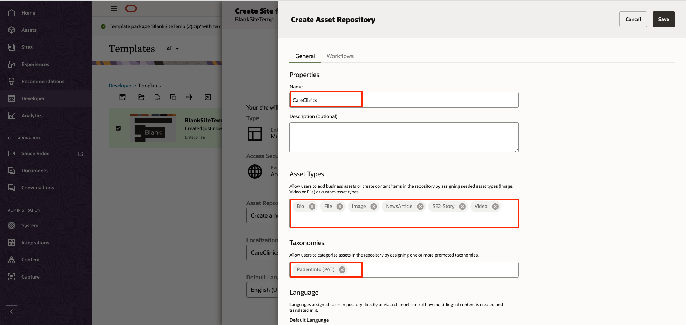
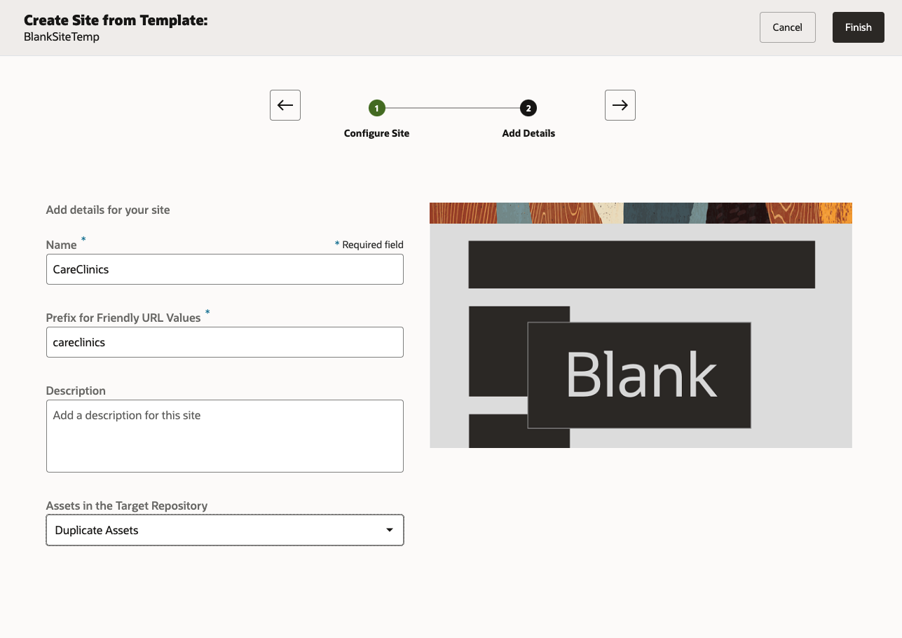
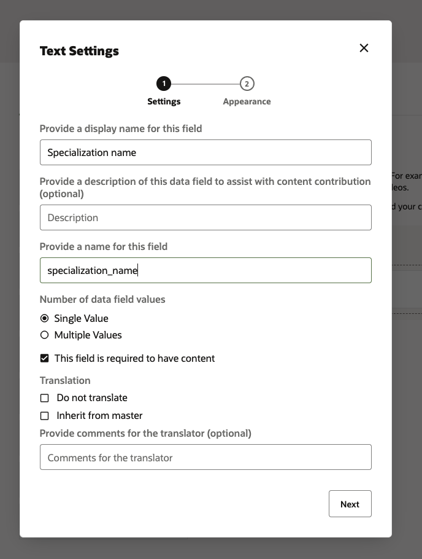
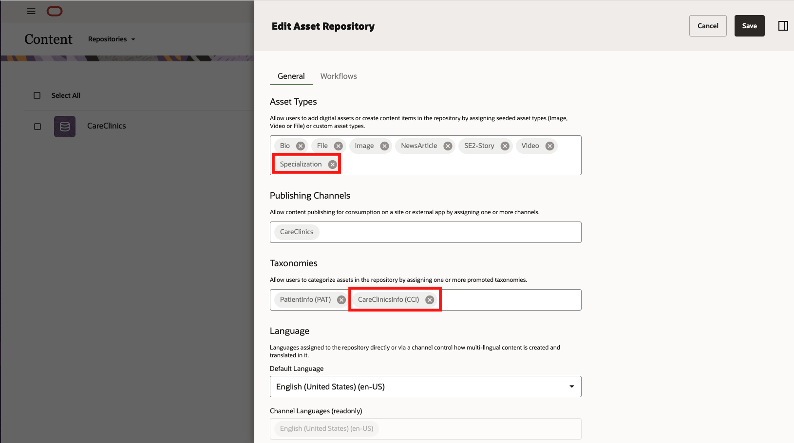

# Build a Healthcare Portal using Oracle Content Management
## Introduction

What is Oracle Content Management?

Oracle Content Management is a cloud-based content hub to drive omni-channel content management and accelerate experience delivery. It offers powerful collaboration, workflow management, and development capabilities to streamline the creation and delivery of content and improve customer and employee engagement.

In this lab, you will build a website for Care Clinics and integrate a chatbot to help the patients to schedule an appointment online.

Estimated Time: 2 hours

### Objectives

In this lab, you will learn how to:

- Create a website from a Blank Template.
- Build assets and publish them on the website using the Asset Management capability within OCM. 
- Sync the documents in your local machine. 
- Use recommendations and audience attributes feature to show only relavent data to the patients. 
- Integrate Chatbot onto the web page.

## Pre-requisites

Template: 

## Task 1: Create a Oracle Content Management Instance and Import the template

1. Log in to the Oracle Cloud at cloud.oracle.com. Cloud Account Name is howarduniversity. Click “Next”.
2. Click on “Direct Sign-In” and enter your Cloud Account email and password.
3. Once you are logged in, you are taken to the cloud services dashboard where you can see all the services available to you. Click the navigation menu in the upper left to show top level navigation choices.
4. Click **Instances** under **Content Management**
  
5. Select the CareClinics compartment and create an instance.
  
6. After the instance is successfully created. Click on the *Open Instance* to open the OCM console. 
  
7. Click on Sites on the left navigation pane, click on *Configure* and *Save* button on the next screen. 
  
8. Click on the View all templates in the Developer tab. 
  
9. Go ahead and import the template package which you dowloaded. 
  

10. Upload the file into documents and hit the *OK* button to import a template.
  

## Task 2: Create a Site from the template

1. Go ahead and click on the icon to create a site from the template which you just imported.
  

2. Now, select Create a new repository from the drop-down under the Asset Repository sections. 
  

3. In properties section, enter the following details and hit the *Save* button: 
  - Name: CareClinics
  - Asset Types: Bio, File, Image, NewsArticle, SE2-Story, Videos
  - Taxonomy - PatientInfo(PAT)
    

4. Under the configure site section, enter the following details: 
  - Name: CareClinics
  - Assets in Target Repository - Leave it as is (Default - Duplicate Assets)
    
  - Now hit the *Finish* button.
  
## Task 3: Prepare a Repository

Create a Asset type: 

1. Select *Content* under the *Administration section* in the left navigation pane.  
2. Pick Asset types from the drop down and click on the *Create* button on the top right of the page to create your own Asset type.
3. Now, enter the following details:
  - Name: Specialization
  - Choose Asset Type: Create a Content Item type
  - Click the *Create* button
    
  - Drag and drop the *Text* field under the Content type definition and update the *Text settings* as follows:
  - Provide the display name - *Specialization name* and click the *Next* button.
  
  - *Save* the Asset Type.

Create Taxonomies:

1. Select *Taxonomies* from the drop-down.
  
2. Create a taxonomy to display the information regarding CareClinics.
  - Name: CareClinicsInfo
  - Abbreviation: CCI
  
  - Add Category - Blogs
  - Add Sibling - Health Talks
  - Add Sibling - Testimonials
  - Select the following checkbox to allow publishing the taxonomy and click the *Done* button.
    

3. Select the Taxonomy (CareClinicsInfo) which you just created and click the *Promote* button.
   

4. Confirm to proceed Promotion. 
   

Add the Taxonomy and Content types to the Repository:

1. Edit the repository by adding the Specialization content type and CareClinicsInfo taxonomy to the CareClinics Repository.
   
2. Click the *Save* button.

  
